# 开源项目研究集

记录近期发现的优秀 GitHub 项目，从体验、源码阅读到复现与实践，逐步积累可复用的研究成果。

这里是研究总入口：每个子项目使用独立编号，包含项目介绍、研究笔记、效果截图，以及可选的 Web 演示。

[在线演示导航](https://yydshly.github.io/0910_codex_project/) · [Agent 任务逻辑与汇总图](https://yydshly.github.io/0910_codex_project/001-system-prompts-leaks/#logic)

## 项目索引

按编号升序排列，编号与子项目目录保持一致。

<!-- PROJECT_INDEX_START -->
| 编号 | 研究项目 | 原始仓库 | 摘要 | 状态 | 在线演示 |
| :--- | :--- | :--- | :--- | :--- | :--- |
| 001 | [System Prompts Leaks](projects/001-system-prompts-leaks/README.md) | [asgeirtj/system_prompts_leaks](https://github.com/asgeirtj/system_prompts_leaks) | 汇集多款 AI 产品的系统提示词与工具说明，帮助我们理解 Agent 的行为规则、比较产品设计，并为自建助手的指令与工作流程提供参考 | 研究与线上展示完成 | [打开演示](https://yydshly.github.io/0910_codex_project/001-system-prompts-leaks/) |
| 002 | [Memmy Agent](projects/002-memmy-agent/README.md) | [MemTensor/memmy-agent](https://github.com/MemTensor/memmy-agent) | 为多个 AI Agent 提供共享长期记忆，支持历史采集、经验提炼与任务续接，并内置独立 Agent 执行环境 | 文档与远端展示完成；上游未实测 | [打开演示](https://yydshly.github.io/0910_codex_project/002-memmy-agent/) |
| 003 | [AnySearch Skill](projects/003-anysearch-skill/README.md) | [anysearch-ai/anysearch-skill](https://github.com/anysearch-ai/anysearch-skill) | AnySearch 云端搜索服务的开源客户端，为 Agent 接入通用与专业检索、并行查询和正文抽取；可参考其工具设计，并与 Tavily、Exa 等服务比较实际增量价值 | 研究与线上展示完成；基础接口已验证 | [打开展示](https://yydshly.github.io/0910_codex_project/003-anysearch-skill/) |
| 004 | [Pi Agent Harness](projects/004-pi/README.md) | [earendil-works/pi](https://github.com/earendil-works/pi) | 统一多模型接入，提供文件读写、命令执行、多轮工具调用、会话与上下文管理，并支持 Skills、扩展和 SDK/RPC 集成，可用于编程任务与定制业务助手 | 完整理解与线上展示完成；上游未运行 | [在线展示](https://yydshly.github.io/0910_codex_project/004-pi/) |
| 005 | [Caveman](projects/005-caveman/README.md) | [JuliusBrussee/caveman](https://github.com/JuliusBrussee/caveman) | 模型调用前按类型精简上下文并支持原文恢复，价值在于专用规则与恢复设计；与 Codex 原生能力部分重合，不表示我们建议叠加使用，也不表示已经确认叠加有收益 | 文档与架构研究完成；叠加收益未实测 | — |
| 006 | [Maigret](projects/006-maigret/README.md) | [soxoj/maigret](https://github.com/soxoj/maigret) | 按用户在网站设置的账号用户名（非实名），通过预设规则批量检查公开账号并提取资料；范围限规则库及所选站点，不覆盖全网，同名账号仍需核验 | 文档与线上展示完成；上游未实测 | [在线阅读](https://yydshly.github.io/0910_codex_project/006-maigret/) |
| 007 | [DeepTutor](projects/007-deeptutor/README.md) | [HKUDS/DeepTutor](https://github.com/HKUDS/DeepTutor) | 可自部署的 AI 教学工作台，支持资料问答、解题、出题、学习路径与复习；与 NotebookLM、Open Notebook、SurfSense 共用许多底层方法，更侧重可修改的教学流程与学习状态，可为我们的开源项目学习导师提供设计参考 | 完整理解与线上展示完成；上游未实测 | [在线阅读](https://yydshly.github.io/0910_codex_project/007-deeptutor/) |
| 008 | [Pi Web](projects/008-pi-web/README.md) | [agegr/pi-web](https://github.com/agegr/pi-web) | 基于 Pi 的自托管浏览器编程工作台，支持读写代码、执行命令、会话与文件管理、模型和技能配置；与 Codex、Claude Code、Cursor Agent 同属 AI 编程工具，可用于研究 GitHub 项目、组织个人开发，并为自建领域助手提供工作台与扩展设计参考 | 完整理解与线上展示完成；上游未实测 | [在线展示](https://yydshly.github.io/0910_codex_project/008-pi-web/) |
| 009 | [YC AI Research](projects/009-yc-ai-research/README.md) | [原始文章（非代码仓库）](https://www.empirical.health/blog/yc-startups-publishing-ai-research) | AI 研究资讯汇总博客，整理 YC 创业公司、研究方向和论文链接；对我当前寻找可用工具、研究 GitHub 项目的直接价值有限，主要作为信息来源与候选项目线索保留，按需查阅，不列为重点研究 | 参考资料归档；按需查阅 | [在线阅读](https://yydshly.github.io/0910_codex_project/009-yc-ai-research/) |
| 010 | [Awesome OSINT Arsenal](projects/010-awesome-osint-arsenal/README.md) | [rawfilejson/awesome-osint-arsenal](https://github.com/rawfilejson/awesome-osint-arsenal) | 以工具查找为主的工具合集，按用途整理情报与安全工具、网站及学习资料，并提供获取方式和批量安装脚本，帮助找到并准备所需工具。 | 完整理解与工具查找展示完成；按要求未安装工具 | [打开工具导航](https://yydshly.github.io/0910_codex_project/010-awesome-osint-arsenal/) |
| 011 | [Luvus](projects/011-luvus/README.md) | [RizRiyz/luvus](https://github.com/RizRiyz/luvus) | Luvus 是多 Agent 终端工作台，统一接入 Claude Code、Codex、Pi 等编程助手，支持任务下发与依赖管理、会话恢复、状态跟踪、并行工作目录协调、检查命令和分支整合，并提供远程接入、定时任务与模块扩展 | 中文研究与线上展示完成；上游未运行 | [在线阅读](https://yydshly.github.io/0910_codex_project/011-luvus/) |
| 012 | [Crypto 101](projects/012-crypto101-book/README.md) | [crypto101/book](https://github.com/crypto101/book) | 面向程序员的密码学入门书源码，通过加密、认证、密钥与漏洞案例解释完整安全系统，并提供多格式书稿构建流程；适合基础学习、中文知识整理与教学参考 | 关键知识清单与线上导读完成；上游未实测 | [开始学习](https://yydshly.github.io/0910_codex_project/012-crypto101-book/) · [关键知识清单](https://yydshly.github.io/0910_codex_project/012-crypto101-book/knowledge.html) |
| 013 | [Plinkopinball](projects/013-plinkopinball/README.md) | [andrewwoan/codrops-demo-for-threejs-conference](https://github.com/andrewwoan/codrops-demo-for-threejs-conference) | 将 Blender 三维场景、钉板落球与弹珠台玩法结合，支持物理碰撞、挡板、轨道和动态声音，可用于创意活动、小游戏及 Three.js 教学，借鉴烘焙视觉、低维物理与实例化渲染的组合 | 中文研究与展示已制作；发布待验证 | — |
| 014 | [threestudio](projects/014-threestudio/README.md) | [threestudio-project/threestudio](https://github.com/threestudio-project/threestudio) | 依赖 NVIDIA GPU/CUDA、Python/PyTorch、三维计算组件及预训练权重的 AI 三维生成框架；接收文字、参考图或场景数据，支持生成、指令编辑与几何纹理优化，输出三维表示、纹理网格和环绕预览 | 文档与模块总览完成；上游安装和生成未实测 | — |
<!-- PROJECT_INDEX_END -->

## 项目预览

### 001 · System Prompts Leaks

[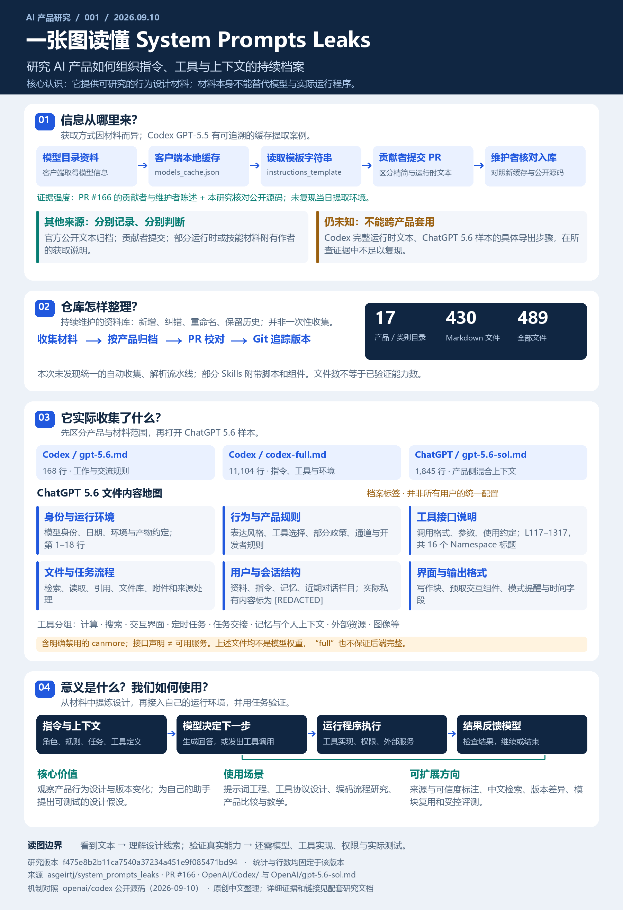](projects/001-system-prompts-leaks/README.md)

研究 AI 产品如何用提示词组织行为、工具和任务流程，附可交互的「Agent 解剖室」。图源：本研究原创总览，依据固定研究版本、PR #166 与公开源码绘制，非产品截图。[放大查看](projects/001-system-prompts-leaks/assets/research-overview.svg) · [研究详情](projects/001-system-prompts-leaks/README.md) · [打开在线展示](https://yydshly.github.io/0910_codex_project/001-system-prompts-leaks/) · [展示运行说明](projects/001-system-prompts-leaks/web/README.md)

### 002 · Memmy Agent

[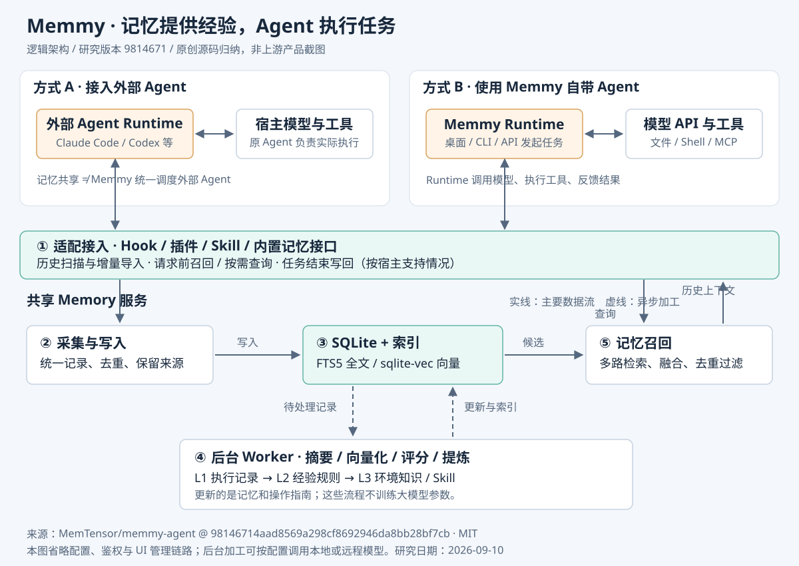](projects/002-memmy-agent/README.md)

理解“请求接入 → 历史召回 → Agent 执行 → 结果写回 → 后台加工”，并与此前的 Mnemosyne 对照，细化失败回退和数据流。图源：依据固定版本源码原创绘制，非产品截图。[完整研究](projects/002-memmy-agent/README.md) · [放大架构图](projects/002-memmy-agent/assets/architecture.svg) · [Web 页面运行说明](projects/002-memmy-agent/web/README.md)

### 003 · AnySearch Skill

[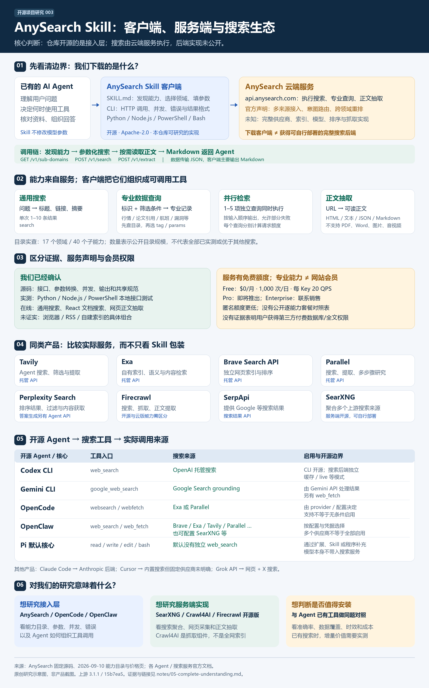](projects/003-anysearch-skill/notes/05-complete-understanding.md)

理解开源接入层与远端检索服务的职责，以及已有搜索工具的 Agent 是否需要额外 Skill。图源：依据固定源码、2026-09-10 能力目录及官方文档原创整理，非产品截图；未公开实现与未实测能力已标注。[打开在线展示](https://yydshly.github.io/0910_codex_project/003-anysearch-skill/) · [完整理解总稿](projects/003-anysearch-skill/notes/05-complete-understanding.md) · [放大总览图](projects/003-anysearch-skill/assets/research-overview.svg) · [验证记录](projects/003-anysearch-skill/notes/02-verification.md)

### 004 · Pi Agent Harness

[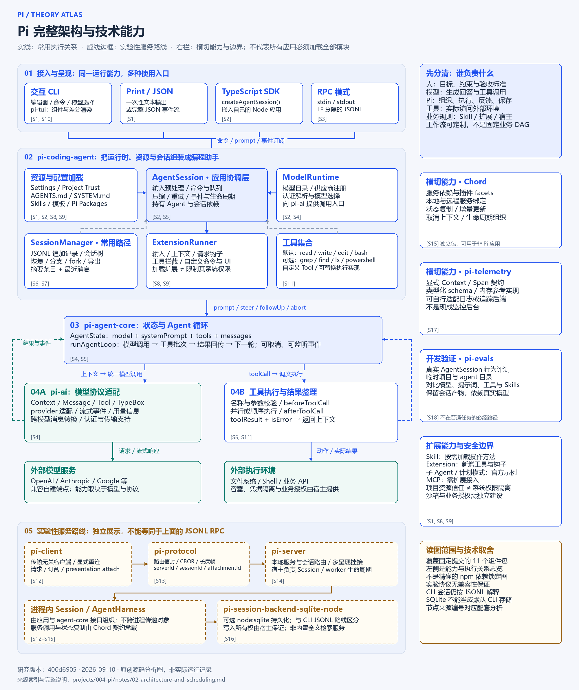](projects/004-pi/notes/02-architecture-and-scheduling.md)

研究可扩展编程助手如何组织模型、工具与会话。图源：依据固定提交文档与源码原创整理，非实际运行记录；明确区分常用路径与实验性服务。[完整理论分析](projects/004-pi/notes/02-architecture-and-scheduling.md) · [架构原图](projects/004-pi/assets/architecture.svg) · [业务调度流程图](projects/004-pi/assets/scheduling-flow.svg) · [研究详情](projects/004-pi/README.md)

新增 [Pi 能力实验室](projects/004-pi/web/README.md)：逐步查看任务执行，切换会话分支，组合扩展能力。全部交互为教学模拟。[完整理解](https://yydshly.github.io/0910_codex_project/004-pi/understanding.html) · [架构与调度双图](https://yydshly.github.io/0910_codex_project/004-pi/theory.html) · [在线实验室](https://yydshly.github.io/0910_codex_project/004-pi/)。

### 005 · Caveman

[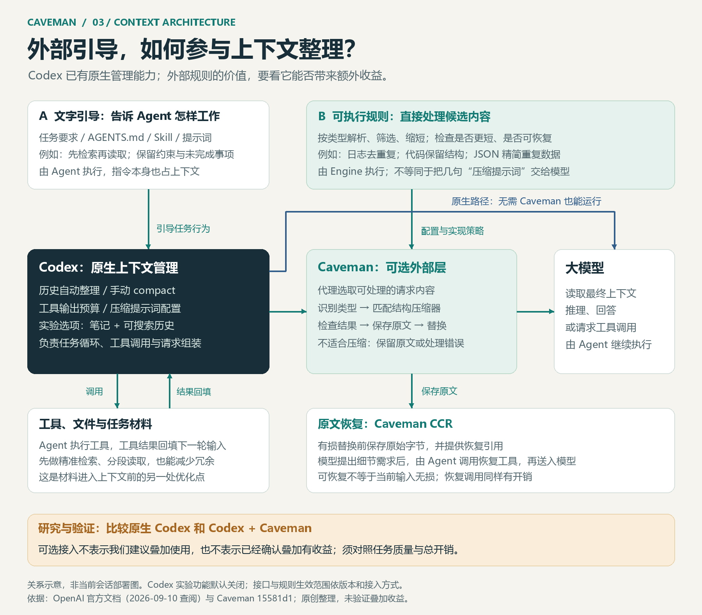](projects/005-caveman/README.md)

研究模型输入的分类精简、原文恢复和专用规则价值。Codex 已有原生上下文管理，两者能力部分重合；图中可选接入不表示我们建议叠加使用，也不表示已经确认叠加有收益。图源：依据 Caveman 固定提交与 OpenAI 官方文档原创整理，非部署截图。[理解整理](projects/005-caveman/notes/02-native-context-and-external-guidance.md) · [外部引导架构图](projects/005-caveman/assets/external-guidance-architecture.svg) · [能力与原理](projects/005-caveman/README.md)

### 006 · Maigret

[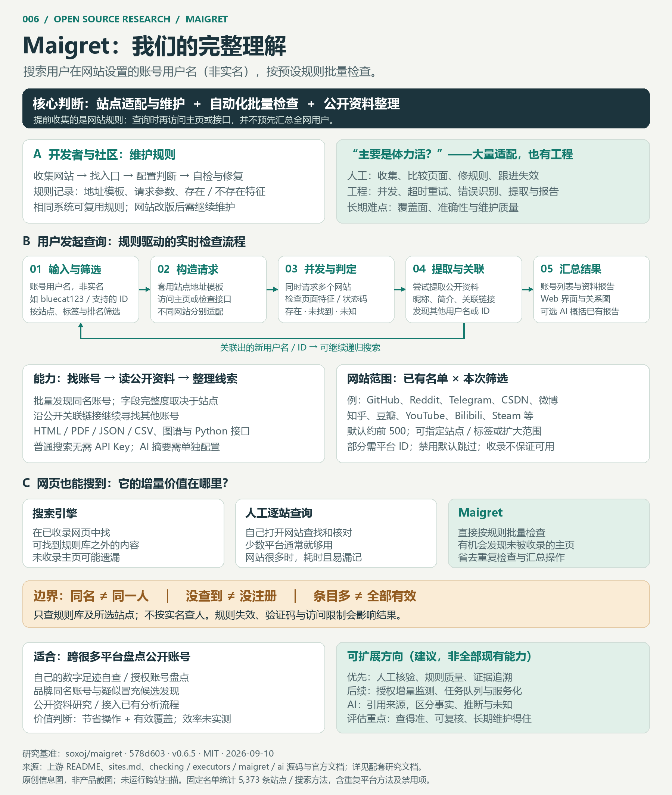](projects/006-maigret/notes/01-understanding.md)

理解“维护网站规则 → 按用户设置的账号用户名（非实名）批量检查 → 提取与整理线索”。搜索范围限于规则库及所选站点，同名结果不证明属于同一人。图源：依据固定提交源码、官方文档及本次讨论原创绘制，非产品截图；未运行跨站扫描。[在线阅读](https://yydshly.github.io/0910_codex_project/006-maigret/) · [完整理解](projects/006-maigret/notes/01-understanding.md) · [放大总览图](projects/006-maigret/assets/research-overview.svg) · [项目资料](projects/006-maigret/README.md)

### 007 · DeepTutor

[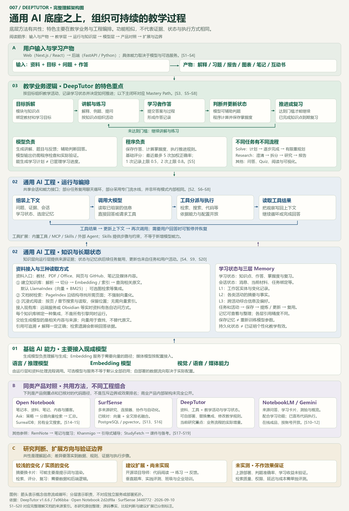](projects/007-deeptutor/notes/01-understanding.md)

从资料问答、解题与出题延伸到学习路径和复习。对照 NotebookLM 的成品学习体验、Open Notebook 的笔记研究和 SurfSense 的多来源研究，重点借鉴 DeepTutor 可修改的教学规则与学习状态，探索“项目讲解 → 练习 → 验证 → 反馈”。图源：依据固定源码、官方文档及本次讨论原创整理，非产品截图；扩展尚未实现，教学效果未实测。[在线阅读](https://yydshly.github.io/0910_codex_project/007-deeptutor/) · [完整理解](projects/007-deeptutor/notes/01-understanding.md) · [放大完整架构图](projects/007-deeptutor/assets/full-architecture.svg) · [网页运行说明](projects/007-deeptutor/web/README.md)

### 008 · Pi Web

[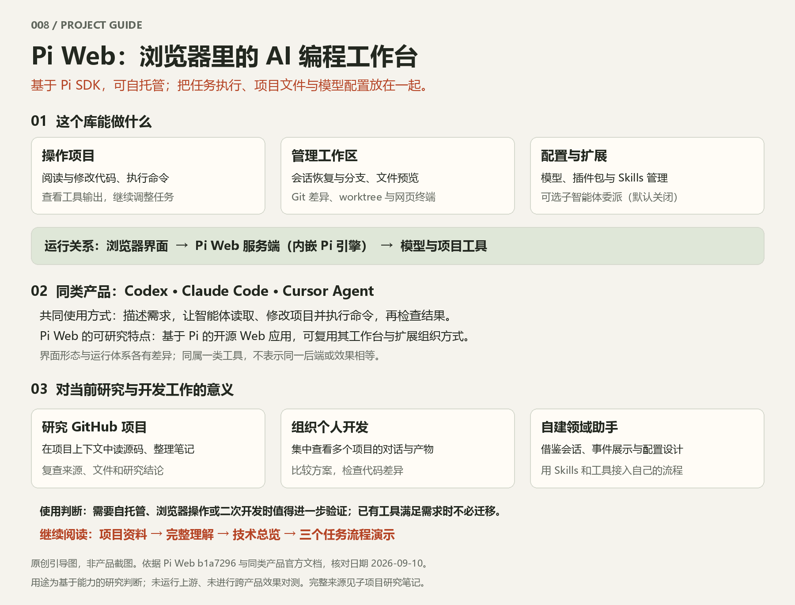](projects/008-pi-web/README.md)

Pi Web 提供可自托管的浏览器 AI 编程工作台，把代码操作、任务会话、文件预览与模型配置放在一起。同类参照为 Codex、Claude Code、Cursor Agent；对当前工作可用于研究 GitHub 项目、组织个人开发，并借鉴其工作台与扩展设计自建领域助手。图源：依据固定源码与同类产品官方文档原创整理，非产品截图；用途为研究判断，未做效果对测。[项目资料](projects/008-pi-web/README.md) · [放大引导图](projects/008-pi-web/assets/entry-guide.svg) · [完整理解](projects/008-pi-web/notes/01-understanding.md) · [技术总览](projects/008-pi-web/assets/research-overview.svg) · [在线展示](https://yydshly.github.io/0910_codex_project/008-pi-web/)

### 009 · YC AI Research

[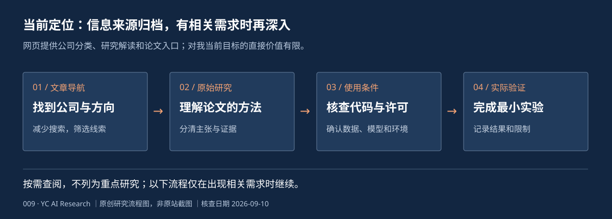](projects/009-yc-ai-research/README.md)

这是一篇人工智能研究与创业科技资讯汇总文章，提供公司分类、研究解读和论文入口。对我当前目标的直接价值有限，作为信息来源按需查阅；有具体需求时再研究所链接的项目。图源：本项目原创研究流程图，非原站截图；模型未实测。[在线阅读](https://yydshly.github.io/0910_codex_project/009-yc-ai-research/) · [研究详情](projects/009-yc-ai-research/README.md) · [网页运行说明](projects/009-yc-ai-research/web/README.md)

### 010 · Awesome OSINT Arsenal

[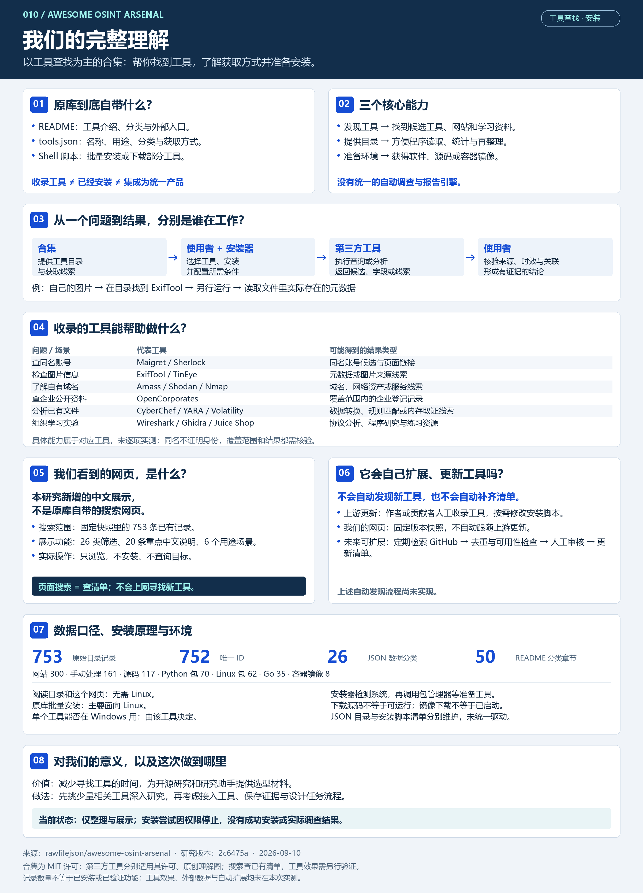](projects/010-awesome-osint-arsenal/README.md)

以工具查找为主，按用途整理工具目录、获取方式与安装脚本，帮助找到并准备所需工具。中文网页可以搜索已有清单，但不会上网自动寻找新工具，也不自动跟随上游更新。图源：依据固定源码与本次讨论原创排版，非运行截图；工具未安装或实测。[打开工具查找导航](https://yydshly.github.io/0910_codex_project/010-awesome-osint-arsenal/) · [完整理解](projects/010-awesome-osint-arsenal/notes/01-understanding.md) · [高清总览图](projects/010-awesome-osint-arsenal/assets/complete-understanding.png) · [项目资料](projects/010-awesome-osint-arsenal/README.md)

### 011 · Luvus

[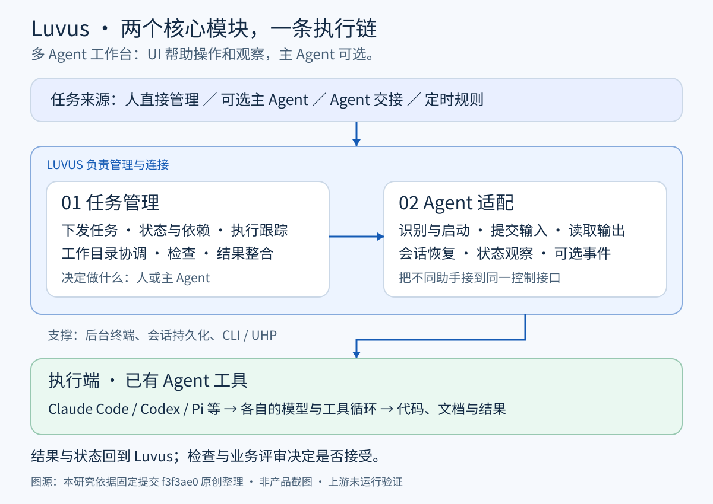](projects/011-luvus/README.md)

统一接入多种编程助手，支持任务下发、依赖与会话管理、状态跟踪、并行工作目录协调、检查和分支整合，并提供远程接入、定时任务与模块扩展。来源：依据固定源码原创整理，非产品截图；上游未运行验证。[在线阅读](https://yydshly.github.io/0910_codex_project/011-luvus/) · [完整理解与产品对照](projects/011-luvus/notes/01-understanding.md) · [放大模块图](projects/011-luvus/assets/entry-guide.svg) · [详细架构](projects/011-luvus/notes/02-full-architecture.md) · [网页运行说明](projects/011-luvus/web/README.md)

### 012 · Crypto 101

[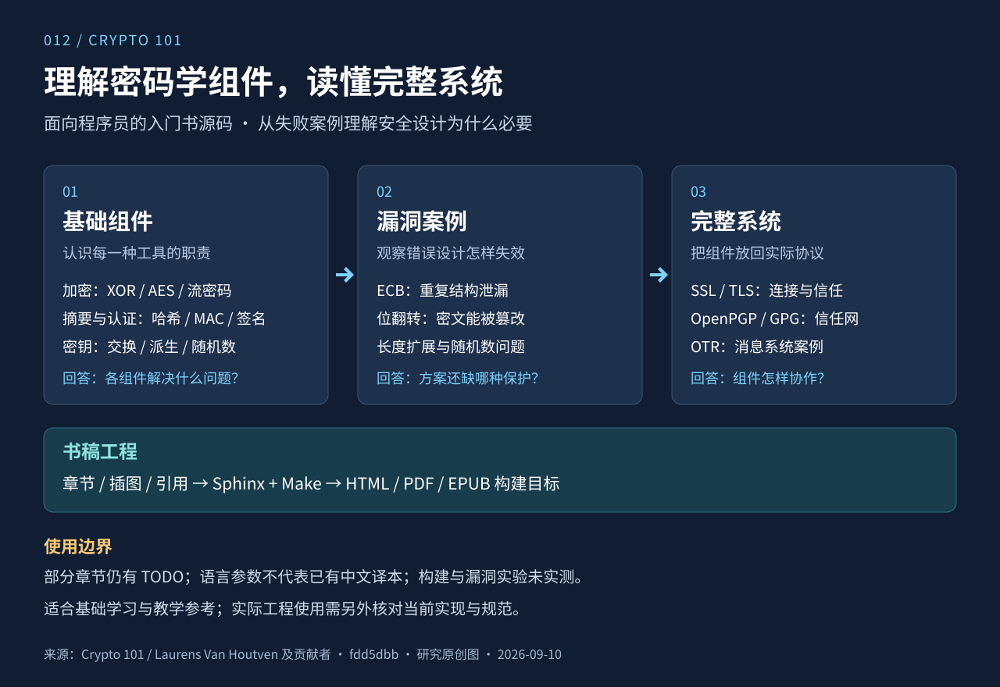](projects/012-crypto101-book/README.md)

沿“基础组件 → 漏洞案例 → 完整系统”理解密码学，网页提供章节目标、细节导读、自检与个人进度；52 项关键知识清单帮助逐点查漏，明确区分原书提炼与外部补学。来源：依据固定书稿原创绘制，非运行截图；部分章节有 TODO，上游构建与实验未实测。[项目资料](projects/012-crypto101-book/README.md) · [能力详解](projects/012-crypto101-book/notes/01-capabilities.md) · [放大概览图](projects/012-crypto101-book/assets/capability-overview.svg) · [学习路线](projects/012-crypto101-book/notes/03-learning-path.md) · [开始在线学习](https://yydshly.github.io/0910_codex_project/012-crypto101-book/) · [关键知识清单](https://yydshly.github.io/0910_codex_project/012-crypto101-book/knowledge.html)

### 013 · Plinkopinball

[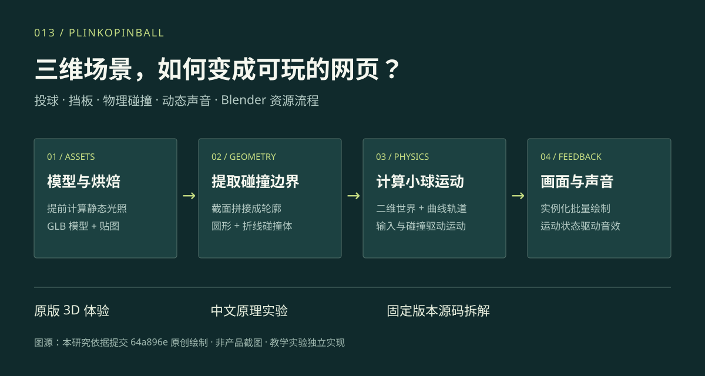](projects/013-plinkopinball/README.md)

把钉板落球、弹珠台和动态声音放进精细三维场景，借鉴 Blender 资源流程、二维物理与三维画面的组合。展示包含作者原版入口、独立中文物理实验及源码拆解。图源：本研究依据固定源码原创绘制，非产品截图；实验不代表上游性能。[项目资料](projects/013-plinkopinball/README.md) · [完整理解](projects/013-plinkopinball/notes/01-understanding.md) · [放大流程图](projects/013-plinkopinball/assets/capability-overview.svg) · [网页运行说明](projects/013-plinkopinball/web/README.md)

### 014 · threestudio

[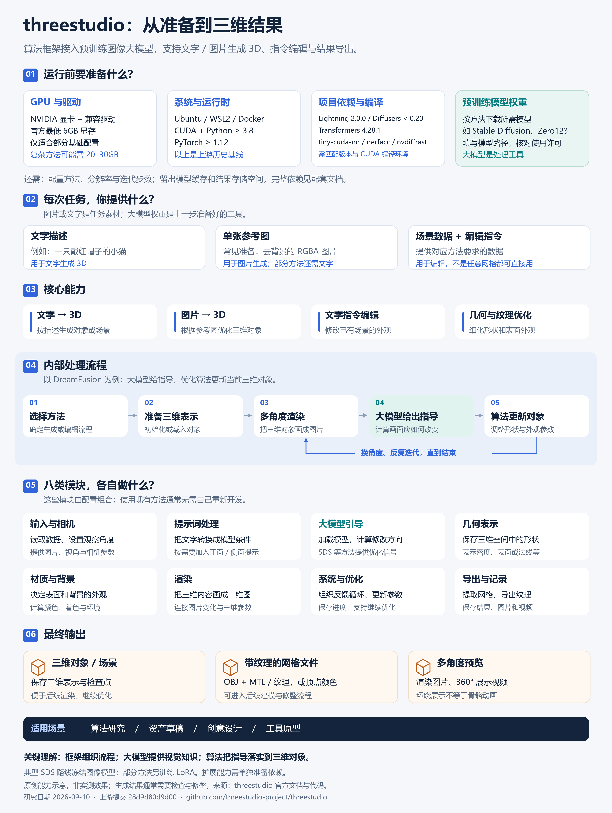](projects/014-threestudio/README.md)

需要 NVIDIA GPU、CUDA、Python/PyTorch、项目依赖与预训练模型权重；输入文字、图片或对应场景数据，通过大模型指导和三维优化生成或编辑对象，导出三维表示、带纹理网格及多角度预览。图源：依据固定上游文档、配置和关键源码原创绘制，非运行截图；上游安装和生成未实测。[完整理解](projects/014-threestudio/notes/01-understanding.md) · [安装准备与模块职责](projects/014-threestudio/notes/02-setup-and-modules.md) · [高清 PNG](projects/014-threestudio/assets/complete-overview.png) · [可缩放 SVG](projects/014-threestudio/assets/complete-overview.svg) · [研究详情](projects/014-threestudio/README.md)

## 仓库导航

[新增专题：Agent 如何推进任务](projects/001-system-prompts-leaks/notes/06-agent-task-loop.md) · [任务逻辑汇总图](projects/001-system-prompts-leaks/assets/agent-task-loop.svg)

| 入口 | 内容 |
| :--- | :--- |
| [研究项目](projects/README.md) | 编号约定、目录结构与研究状态 |
| [子项目模板](templates/project/README.md) | 项目介绍、研究记录、图片说明与运行指引 |
| [新增项目指南](docs/adding-projects.md) | 从登记项目到更新首页的步骤 |
| [Web 演示约定](docs/web-demos.md) | 多个演示的地址规划与部署记录要求 |

## 研究方式

发现与筛选 → 本地体验 → 源码研究 → 实践验证 → 总结归档。

保留原项目链接、所研究的版本及许可证信息。区分原项目能力、实际验证结果与个人推测；优先记录有用的结论和可复现的过程。
