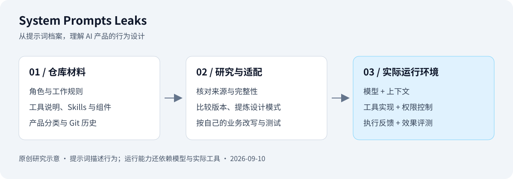

# 001 · System Prompts Leaks

收集 AI 产品的系统提示词、工具说明和任务流程，适合研究提示词工程与 Agent 产品设计。

## 项目资料

| 项目 | 内容 |
| :--- | :--- |
| 原始仓库 | https://github.com/asgeirtj/system_prompts_leaks |
| 上游说明 | [README](https://github.com/asgeirtj/system_prompts_leaks/blob/f475e8b2b11ca7540a37234a451e9f085471bd94/README.md) |
| 研究版本 | `f475e8b2b11ca7540a37234a451e9f085471bd94`，提交时间 2026-09-09 22:44:31 UTC |
| 上游许可证 | [CC0 1.0 Universal](https://github.com/asgeirtj/system_prompts_leaks/blob/f475e8b2b11ca7540a37234a451e9f085471bd94/LICENSE)，记录仓库声明，未逐项核查第三方材料的权利来源 |
| 技术栈 | Markdown / Git 为主，部分 Skills 附带 JS、TS、Python 与组件文件 |
| 研究状态 | 已完成文本研究与交互展示；未复现提取过程或执行上游配套代码 |
| 收录日期 | 2026-09-10 |
| 最近更新 | 2026-09-10 |
| 在线演示 | — |

## 研究摘要

- **核心能力：** 集中浏览多产品提示词，利用 Git 查看历史变化，研究工具使用约定、任务分解和输出规范。
- **技术原理：** 按厂商与产品组织文件，通过提交和 PR 更新。文本描述 AI 应当怎样工作；工具执行仍依赖实际宿主程序。
- **适用场景：** 设计自己的助手、研究编码 Agent 工作流程、比较产品行为规则、整理教学案例。
- **可扩展方向：** 来源与可信度标注、中文检索、语义版本比较、模块化提示词库和受控评测。
- **限制与取舍：** 收录不等于真实性或完整性经过独立认证；复制提示词也不能复现原产品全部能力。

## 一图总览

图 1：从获取证据到研究用途的完整概述。来源：本研究原创，依据固定研究版本、PR #166 与 OpenAI 公开源码整理；明确区分来源陈述、直接可见内容和未确认事项。[可放大的 SVG](assets/research-overview.svg) · [详细证据与逐段解释](notes/03-codex-acquisition-chatgpt56.md)。

从组成继续理解过程：[任务逻辑汇总图](assets/agent-task-loop.svg) · [Agent 如何推进任务](notes/06-agent-task-loop.md)。图中串起依据准备、模型规划、程序调度、工具执行与反馈，Web 的“任务逻辑”可切换正常、失败调整、等待审批和信息不足四条路径，并逐步查看模型调用次数和消息流。

## 结构示意

图 2：档案、研究适配与实际运行环境之间的关系。来源：本研究原创示意图，依据上述研究版本的目录和代表性文件绘制；不是上游产品截图。

## 研究问题

- [x] 项目的核心使用流程是什么？
- [x] 关键材料如何组织，提示词与实际工具如何配合？
- [x] 哪些设计值得借鉴，有哪些使用条件？
- [ ] 提示词捕获结果是否与原产品实际运行环境一致？
- [ ] 配套 Skills、脚本和组件能否在独立环境复现？

## 本地使用

已新增独立 Web 展示「Agent 解剖室」：5 个代表性产品、24 项能力解读、3 个逐步执行示例、17 个目录的收录全景，以及“意义与用法”中的 3 个迁移示例。“任务逻辑”提供四条路径（共 29 个路径阶段）、消息流说明和汇总图，六篇研究文档均提供网页阅读版。进入 [Web 子项目](web/README.md) 查看运行说明。教学示例不调用真实模型；尚未上线。

上游主要用于阅读和分析，没有在其根目录提供统一应用启动入口。直接打开上游固定版本链接即可研究；本地展示使用零第三方依赖的静态页面。

本次通过 GitHub API 读取提交与递归目录，并抽查贡献指南、Cursor、Gemini CLI、官方归档说明及 Claude Design Skills 说明。未下载完整上游副本，未运行其脚本。

## 笔记与实践

- [Agent 如何推进任务：本轮理解整理与任务逻辑总图](notes/06-agent-task-loop.md)
- [官方样例组成图：Agent 包含哪些部分](notes/05-official-agent-anatomy.md)
- [我们的完整理解与研究结论：19 个章节的统一整理](notes/04-complete-understanding.md)
- [完整分析：能力、原理、场景与扩展](notes/01-analysis.md)
- [这个库的意义与实践方法](notes/02-significance.md)
- [Codex 提示词如何获取，以及 ChatGPT 5.6 文件详解](notes/03-codex-acquisition-chatgpt56.md)
- [研究笔记索引](notes/README.md)
- [Web 演示说明](web/README.md)

## 结论

它的主要价值是提供 AI 产品行为设计的可研究材料。应先提炼可解释的规则，再在自己的模型和工具环境中测试效果。现有档案可以支持设计假设，不能单独证明原产品架构或某条提示词的实际收益。

## 来源与许可

上游采用 CC0 1.0 Universal。本研究使用原创中文分析与示意图，未整段复制提示词、脚本或组件。具体证据链接与验证范围见完整分析。

---

[返回总项目索引](../../README.md#项目索引)
