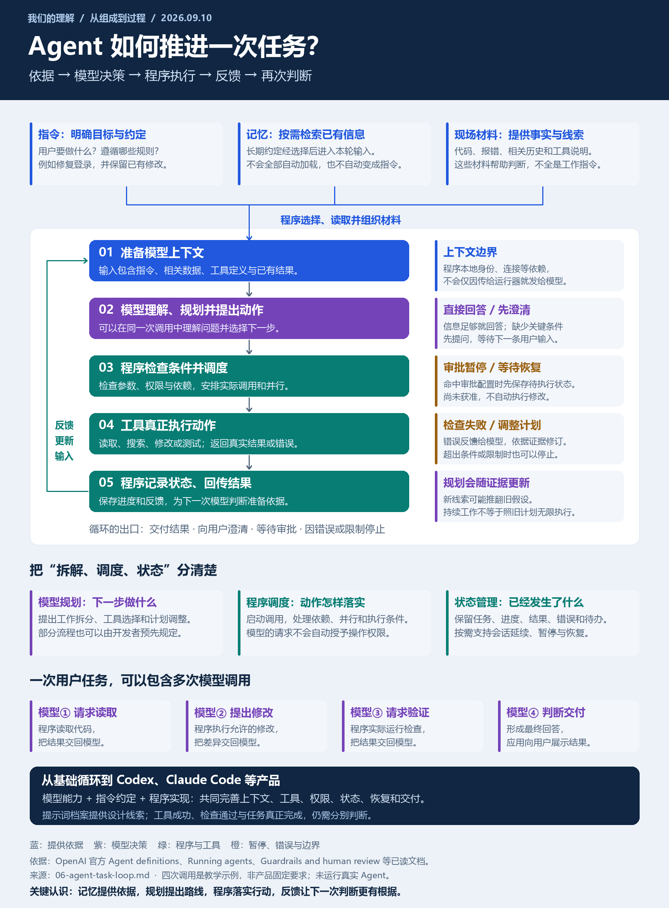

# Agent 如何推进任务：我们的理解与职责划分

整理日期：2026-09-10。本文整合关于理解、规划、调度、记忆、上下文与持续工作的讨论，并进一步补充模型调用计数、消息流和异常分支。依据前文已读取的官方 Agent 文档建立通用模型，不声称还原 Codex 或 Claude Code 的完整内部实现。

[一图汇总 PNG](../assets/agent-task-loop.png) · [可放大的 SVG](../assets/agent-task-loop.svg)

## 1. 我们形成的核心理解

**指令确定目标与工作约定；上下文和经过选择的记忆提供依据；模型提出计划和动作；程序落实调度、权限与工具执行；执行结果和状态变化成为下一次判断的输入。**

这条链路反复运行，直到交付结果、向用户澄清、等待审批或因为限制和错误而停止。规划可以随着新证据调整，不是开始时拆完任务就按原计划一直执行。

需要分清三种职责：

| 职责 | 核心问题 | 主要承担者 |
| :--- | :--- | :--- |
| 提供依据 | 要做什么？已经知道什么？有哪些可用手段？ | 应用准备输入，结合用户任务、指令、上下文与检索结果 |
| 做出决策 | 当前应当回答、调查、调用工具，还是调整计划？ | 模型；部分流程也可以由开发者预先规定 |
| 执行与管理 | 是否允许？如何执行？执行了什么？怎样继续？ | 运行器、工具、权限控制、任务和状态管理程序 |

## 2. 用户提问之后，最先发生什么

通常先由应用准备模型要看的材料，再调用模型。材料可以包括用户问题、工作指令、工具说明、必要历史，以及与本次任务相关的项目或检索内容。

这一步未必需要先做一次模型推理。程序可以直接读取配置、整理会话或按已知条件提供材料；有些系统也会额外设计分类、检索或预处理步骤。不能假设所有 Agent 都有一个独立的“初步理解模型”。

第一次模型调用通常同时完成理解任务与决定下一步。模型可能直接回答，也可能生成结构化工具调用，或要求补充信息。不是每个问题都一定先规划、再调用工具。

**一次用户任务不等于一次模型调用。** 一次调用可以请求读取，程序读取后再调用模型解释结果；模型提出修改，程序修改后还可能再次调用模型决定验证方式。在这类调用式流程中，工具执行或等待输入期间不必持续生成；多次调用通过程序保存的状态和实际提供的上下文衔接。

模型生成的工具调用只是请求。程序需要找到真正的工具实现，并按配置处理参数、权限、审批和执行条件，才能让动作发生。

## 3. 指令、上下文与记忆分别是什么

| 概念 | 我们采用的理解 | 编码任务中的例子 |
| :--- | :--- | :--- |
| 指令 | 目标、职责、规则和完成标准 | 修复登录问题，保留用户已有修改，并报告检查结果 |
| 本轮模型上下文 | 显式提供给本次模型调用的材料 | 指令、用户消息、代码、报错、相关历史、工具定义和结果 |
| 记忆 | 跨会话或任务保留的信息 | 项目使用的测试方式、长期团队约定 |
| 本地运行 context | 留在程序侧供工具或应用使用的依赖与状态 | 已认证身份、数据库连接、日志器 |

上下文是比指令更大的概念。它既可能包含工作要求，也可能包含待分析的数据和工具反馈。因此不能把上下文中的所有文字都当成新的指令。

记忆需要经过选择、检索或显式加载，才能参与本轮判断；不是所有记忆都会自动进入每次模型调用。记忆还需要考虑适用范围、更新、过期和冲突，旧记录不能机械地覆盖当前任务。

检索记忆可以发生在输入准备阶段，也可以在执行途中由模型提出检索请求、程序通过工具落实。上下文太长时，应用可以选择相关片段或进行压缩；摘要可能遗漏信息，关键结论仍应能回到原始证据核对。具体产品采用何种策略需要分别检查。

程序拥有的信息，也不一定已经交给模型。官方 SDK 文档明确区分本地 context 与模型上下文：运行器收到数据库连接或身份信息，不代表这些内容会自动发送给模型。

所以，记忆和上下文主要是为决策提供依据，不能仅将它们理解为“服务于指令下发”。

## 4. 大模型怎样规划，程序怎样调度

模型可以提出：“先定位原因，再修改，再测试；两个独立调查可以并行。”这是对工作内容和顺序的建议。

程序需要落实：调用哪个执行接口、是否允许操作、是否支持并行、怎样处理依赖和返回结果、何时等待或停止。具体系统也可以采用预设流程，减少由模型自由决定的部分。

| 问题 | 主要决策或实现位置 |
| :--- | :--- |
| 应先读哪个文件？下一步还缺什么信息？ | 模型依据任务与上下文提出动作 |
| 要分成哪些子任务？为什么这样分？ | 可以由模型规划，也可以由程序预先定义 |
| 两个工具调用实际怎样并行运行？ | 运行器或调度程序，受工具能力和依赖约束 |
| 某项修改是否超出访问范围？ | 程序层权限控制；模型的判断不能独自授予权限 |
| 子任务、状态和结果存放在哪里？ | 任务及状态管理的实现 |
| 发现新证据后如何调整方案？ | 模型结合反馈重新判断，程序继续落实 |

因此，“模型调度”需要说得具体：它通常是提出动作和分工；真正启动执行、管理资源和强制边界的是程序。

## 5. 工具、权限、任务、状态与持续工作的分工

| 部分 | 主要职责 | 容易产生的误解 |
| :--- | :--- | :--- |
| 工具 | 真实读取、搜索、修改、测试或查询 | 工具说明不是工具实现，模型不能仅凭名称获得执行能力 |
| 权限 | 控制允许的动作与影响范围 | 提示词里的约定不能替代程序实际限制 |
| 任务管理 | 表达任务拆分、依赖、完成条件与进度 | 清单不等于执行；计划变更还需要状态同步 |
| 状态管理 | 保存已有输入、动作、结果、错误和待办 | 状态不只是聊天文字；模型只看到其中被提供的部分 |
| 持续工作 | 推进循环，处理等待、恢复、失败和结束 | 持续工作不等于无限循环，也不保证一定成功 |

这些部分共同支持任务推进，但不能全部称为“拆解”。拆解主要描述将目标分成工作步骤；执行动作、保存状态和限制权限是另外的职责。

工具失败时，程序收集并提供错误信息，模型可以据此调整动作。程序也可能按配置直接重试、暂停或终止。具体行为取决于实现，不能把所有异常处理都归给模型。

## 6. 用一次修复任务贯穿所有环节

以下为本站原创教学情境，不是已运行的 Codex 或 Claude Code 执行轨迹。

用户要求：“修复登录后又跳回登录页的问题，保留我已有的界面修改。”

| 阶段 | 谁在工作 | 到此累计模型调用 | 输入与动作 | 形成的结果 |
| :--- | :--- | ---: | :--- | :--- |
| 1. 准备输入 | 程序 | 0 | 选择任务、指令、工具说明和相关记忆 | 尚未请求模型 |
| 2. 选择读取工具 | 模型 | 1 | 根据初始输入生成读取请求 | 只有请求，尚未读取 |
| 3. 程序读取代码 | 程序与工具 | 1 | 检查允许范围，执行读取并保存结果 | 获得状态恢复线索 |
| 4. 依据结果调整计划 | 模型 | 2 | 结合新证据提出针对性修改 | 只有修改请求，尚未写入 |
| 5. 应用允许的修改 | 程序与工具 | 2 | 检查范围，保留用户变更并编辑 | 修改差异；尚未验证 |
| 6. 请求验证修改 | 模型 | 3 | 看到编辑结果，提出相关检查 | 只有检查请求，尚未运行 |
| 7. 执行检查并通过 | 程序与工具 | 3 | 运行相关检查，返回结果与范围 | 取得检查证据 |
| 8. 判断并形成回答 | 模型 | 4 | 综合目标、差异与检查结果 | 最终回答，无后续工具请求 |
| 9. 向用户交付 | 应用 | 4 | 展示输出并按策略保存记录 | 本次运行结束 |

“页面刷新后的状态恢复”和 `src/session.ts` 仅用于展示新证据如何改变计划，不是对当前项目某个真实缺陷的诊断。正常路径展示九个阶段、四次模型调用；该数字来自教学设计，不是产品固定要求。

原来的八阶段讲解将部分模型判断与程序动作合并。细化后将读取、修改、测试和交付对应的调用分别标出，便于追踪“什么时候真正再次调用了模型”。一个模型响应可以包含多个调用请求，真实产品还可能采用并行、预设流程和专用工具；不要将此示例推广为每次调用只能做一件事。

## 7. 循环怎样继续、暂停与结束

运行器把工具结果补充到后续模型输入，模型据此再次判断。这个循环不要求把整个记忆库或全部历史原样重发；具体系统需要选择适用的上下文管理方式。

典型分支包括：

- **继续：** 仍需获取信息、修改或验证，生成下一次动作。
- **重新规划：** 新证据推翻旧假设，更新任务路线。
- **澄清：** 缺少决定性信息，向用户提问后等待新的输入。
- **审批暂停：** 配置要求先取得决定，程序保存可恢复状态。
- **结束交付：** 已具备回答或交付条件，没有后续工具工作。
- **受限停止：** 遇到轮次或资源限制、无法处理的错误或其他停止条件，保留并说明已有结果。

一次程序运行可以包含多次模型调用。会话延续、暂停恢复和长期记忆各自解决不同问题；不能把它们统一当成模型“自己一直记得”。

**澄清和审批是两种不同的等待。** 澄清通常将问题作为当前轮输出交给用户，再等待下一条用户输入；审批可能将尚未执行的动作保存在当前运行的可恢复状态中，取得决定后继续原运行。它们都可能让界面显示“等待”，但不能用同一含义解释其内部状态。

## 8. Codex、Claude Code 这类产品完善了什么

我们将这类产品理解为围绕基础循环形成的工程系统。其设计涉及模型、指令和程序三层的配合，而不是仅增加一份更长的提示词。

| 层次 | 作用 | 对任务表现的影响 |
| :--- | :--- | :--- |
| 模型层 | 理解代码、判断线索、规划和生成调用 | 是否能正确理解材料并提出有效动作 |
| 指令层 | 组织工作顺序、完成标准、角色和沟通约定 | 是否倾向于先调查、保留已有修改、验证后交付 |
| 程序层 | 上下文供给、工具、调度、权限、任务状态、恢复和界面 | 动作是否真实可执行，限制是否生效，结果是否可追溯 |

同一条“修改前先读取”的规则，需要模型理解读到的内容，也需要程序提供真实读取和精确编辑。产品还必须处理失败、上下文不足、会话中断和用户交互等细节。

这是一种通用职责分析。具体产品、版本和模式采用哪些机制、做到什么程度，仍需分别核查，不能仅凭提示词收录文件认证其全部实现。

## 9. 对 System Prompts Leaks 的意义

提示词档案帮助我们观察工作规则、接口描述、角色分工与部分上下文样本。研究时可以把每条材料放进这张职责图，继续追问它依赖哪个工具、状态或权限实现。

这也明确了我们的研究产出：从原始材料提炼设计规则，保留出处，标注运行依赖，再用任务验证。材料说明产品希望怎样工作；执行记录与评测才能进一步说明实际上发生了什么、效果如何。

当前已完成本专题、一张汇总图和四条可切换教学路径，共 29 个路径阶段。页面分别显示当前依据、模型职责、程序职责、模型调用次数、运行状态及消息示意。没有调用真实模型、运行上游 Agent 或验证提示词收益。

## 10. 四条路径如何改变工作过程

| 路径 | 阶段 / 模型调用 | 分歧发生在哪里 | 页面最终停在哪里 |
| :--- | :--- | :--- | :--- |
| 正常完成 | 9 / 4 | 读取、修改和检查均得到可继续的结果 | 应用交付 |
| 检查失败后调整 | 13 / 6 | 第一次检查返回失败；模型据此修订动作，再修改和验证 | 在第二次检查通过的教学设定下交付 |
| 修改需要审批 | 5 / 2 | 模型提出修改后，程序命中本例配置的审批条件 | 等待审批，未编辑、未测试 |
| 信息不足先澄清 | 2 / 1 | 现有任务与环境不足以确定项目和问题 | 向用户提问，未调用工具 |

审批路径只是展示一种可配置的处理方式，不表示所有本地修改都必须审批。页面不会自动假定获得授权，也没有实际申请或执行任何外部操作。批准后如何恢复、拒绝后如何反馈，需要应用明确实现；本教学路径停在等待位置。

失败路径展示的是“取得错误依据后调整计划”，不是无条件重试直到成功。真实系统还需处理无法修复、超出资源限制或必须终止的情况。

## 11. 看清模型输入、模型输出、程序动作和反馈

每个阶段的“消息与调用示意”可以展开，分别观察四类信息：

| 类型 | 它表示什么 | 它不表示什么 |
| :--- | :--- | :--- |
| 收到的材料 | 当前模型或程序处理的输入 | 不代表全部信息都发给模型 |
| 模型输出 | 请求某个工具或给出回答的外部输出 | 不是模型隐藏推理或完整内部思考记录 |
| 程序动作 | 检查条件、执行工具、保存状态或展示结果 | 不能仅凭模型的文字声称已发生 |
| 结果或反馈 | 工具实际返回的材料，或此刻仍在等待的状态 | 不把尚未执行的动作写成成功结果 |

例如一个简化调用请求是：

```text
工具：read_file
参数：path = src/session.ts
```

这只表示模型请求读取。之后程序才检查范围、执行读取并返回内容。另一次调用模型时，才会把相关工具结果作为输入。名称和格式属于本站教学示意，不是对某个真实 SDK 协议的逐字段复刻。

## 12. 四个不同层次的“完成”

| 状态 | 当前能确认什么 | 还不能确认什么 |
| :--- | :--- | :--- |
| 计划已形成 | 模型提出工作路线 | 动作尚未发生 |
| 工具请求已生成 | 已有工具名称和参数 | 程序尚未执行，也未必允许执行 |
| 工具执行成功 | 某个动作成功执行，如编辑完成 | 业务问题是否解决，仍需相关证据 |
| 验证通过并交付 | 已有一定覆盖范围的检查与交付 | 不自动保证未检查的所有情境都正确 |

实际任务完成还依赖用户目标和验收标准。程序可以根据模型的最终输出结束本轮，但“停止运行”与“客观上正确完成业务任务”仍是两个需要区分的判断。

## 13. 用这套理解检查自己的 Agent

- 用户任务、长期规则和外部事实是否分清？外部材料有没有被错误提升为执行指令？
- 能否知道每次模型调用究竟看到了哪些相关材料？记忆是何时、为何被选入的？
- 工具请求与真实执行是否有记录？权限由什么程序机制落实？
- 计划、任务进度、调用结果与等待状态是否保持一致？审批拒绝或失败是否被误记成成功？
- 结果失败后怎样调整、暂停或停止？会话继续和原运行恢复是否分清？
- 最终回答是否附有已执行动作和验证证据，并说明未覆盖范围？

这是一组研究与开发时的核对问题，不是本项目已经实现的生产 Agent 控制系统。

## 14. 一图汇总与来源



图：本研究原创中文归纳，2026-09-10。蓝色表示输入准备，紫色表示模型决策，绿色表示程序与工具，橙色表示等待、限制与边界。返回箭头表示根据反馈更新上下文和计划；它不是某个产品的真实运行截图。

- [Agent definitions](https://developers.openai.com/api/docs/guides/agents/define-agents)：模型、指令、工具，以及本地 context 与模型上下文的区别。
- [Running agents](https://developers.openai.com/api/docs/guides/agents/running-agents)：模型与工具循环、状态延续、审批暂停和异常。
- [Guardrails and human review](https://developers.openai.com/api/docs/guides/agents/guardrails-approvals)：输入输出及工具检查、审批与恢复。
- [Integrations and observability](https://developers.openai.com/api/docs/guides/agents/integrations-observability)：工具接入、追踪和评测。
- [官方天气助手组成说明](05-official-agent-anatomy.md)：前文已核对的一手样例与图。
- [完整理解总稿](04-complete-understanding.md)：归档来源、收录范围、意义与验证边界。

上述官方内容已在前文研究中读取，本次重点是整合我们形成的理解，并未重新审计全部产品实现。

[返回项目介绍](../README.md)
