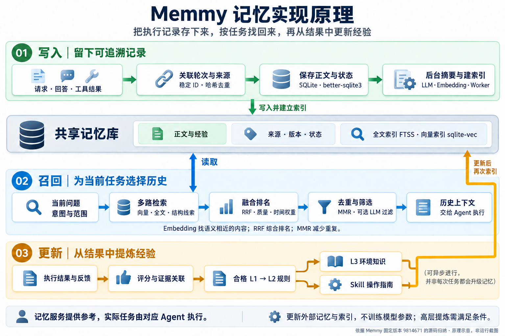
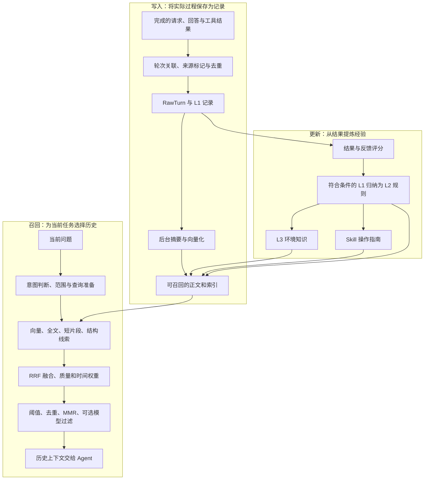

# 记忆模块的实现原理与技术

研究日期：2026-09-10。固定提交 `98146714aad8569a298cf8692946da8bb28bf7cb`；主项目版本 1.1.4，Memory 子包声明版本 2.1.2。本文依据源码归纳，未运行上游服务。

## 1. 它为什么能表现出“记忆”

Memmy 将过去的执行过程保存到模型之外，整理成可检索的记录；新任务到来时，找出有关内容并加入上下文。模型因此可以参考过去。后台还会根据结果和反馈，调整记录价值、归纳规则和操作指南。

从架构上，可以把它理解为**面向 Agent 执行经验的检索增强系统，配合记忆生命周期管理**。这是我们的归纳：持久化解决“留得住”，索引解决“找得到”，筛选解决“带哪些”，上下文注入解决“怎么用”，反馈与提炼解决“以后如何更新”。这些环节更新的是外部记录与索引，不是模型权重。

## 2. 三条内部流程

图 1：根据本文固定版本研究内容，使用内置图像生成工具制作的原理示意，非上游运行截图。[查看原图](../assets/memory-mechanism.png) · [生成提示词](../assets/memory-mechanism-prompt.md)。下方保留可编辑的流程图。

图：本研究依据固定版本源码原创归纳。高层提炼存在条件和分支；不是每条记录依次升级，也不是每次任务必须等待上述全部步骤。手动写入与历史导入的索引就绪规则不同，详见[生命周期](04-request-lifecycle.md)。

## 3. 保存的到底是什么

**记忆正文与向量用途不同。** 正文保存实际内容；向量是一组用于相似度计算的数字，不能代替原始证据。元数据负责回答“来自谁、哪个任务、何时发生、属于哪一层、是否仍有效”。

| 数据结构 | 保存什么 | 用途 |
| --- | --- | --- |
| `sessions` / `episodes` / `raw_turns` | 会话、相关任务过程与原始轮次 | 将分散操作关联为可追溯过程 |
| `memories` | 正文、层级、来源关联、标签、属性、哈希、版本、状态与时间 | 承载 L1 / L2 / L3 / Skill，支持更新与状态管理 |
| `memories_fts` | 全文检索索引 | 根据词语寻找正文候选 |
| `memory_vector_entries` 与向量存储实现 | 向量条目关联与语义索引 | 找到含义接近的记录 |
| `feedback` / `trace_policy_links` | 反馈与轨迹到规则的关联 | 追踪经验依据，调整价值 |
| `evolution_jobs` / `embedding_retry_queue` / `memory_processing_state` | 后台任务、重试与处理状态 | 区分已保存、处理中、可用和失败 |

这些是固定版本中的表或实现入口，不应把其中的来源、用户或可见性字段直接等同于完整的团队权限系统。依据：[schema.ts](https://github.com/MemTensor/memmy-agent/blob/98146714aad8569a298cf8692946da8bb28bf7cb/Memory/src/storage/schema.ts)。

## 4. 用到了哪些技术，具体怎么用

| 技术 | 如何使用 | 解决的问题与边界 |
| --- | --- | --- |
| TypeScript / Node.js | 实现 Memory 服务、适配器、检索编排与 Worker | 将记忆能力提供给不同调用端 |
| SQLite + better-sqlite3 | 本地关系存储、SQL 查询和索引管理 | 持久化正文与处理状态；不自动保证语义正确 |
| 稳定 ID、内容哈希、检查点 | 识别重复轮次或重复导入，并跟踪来源进度 | 减少重复保存；不等于识别所有语义重复 |
| FTS5 | 建立全文索引，依据查询词召回 | 适合关键词；不是语义理解模型 |
| Embedding + Transformers.js | 将查询与记录文本编码为可比较向量；也支持远程 Provider | 连接不同措辞的相近含义；实际模型由配置决定 |
| sqlite-vec、余弦相似度 | 存储与检索语义候选，在算法中比较向量 | 相似度表示相关线索，不表示真实性 |
| 短片段与结构匹配 | 补充中文短词、路径和错误信息等线索 | 弥补单纯关键词或向量的遗漏 |
| RRF 排名融合 | 汇总同一记录在多个检索通道的位置 | 不直接相加不同量纲的原始分数 |
| 质量、层级与时间权重 | 对候选按经验价值、类型及新旧程度调整 | 排序信号不是事实认证 |
| MMR 多样性选择 | 选择相关记录时扣除与已选内容的相似程度 | 减少上下文重复，但存在相关性与多样性的取舍 |
| LLM 结构化生成与过滤 | 摘要、反思、查询提取、经验归纳与候选筛选 | 模型处理依赖配置，失败和无结果需区分 |
| 持久化任务与重试队列 | 把摘要、向量化、评分和提炼放在后台处理 | 保存完成不等于全部加工完成 |
| tiktoken | 对部分摘要与 Embedding 输入做 token 估算和输入规划 | 控制模型输入；不能据此声称所有宿主统一使用该 tokenizer |

依赖依据：[package.json](https://github.com/MemTensor/memmy-agent/blob/98146714aad8569a298cf8692946da8bb28bf7cb/Memory/package.json)。具体算法见下一节。Electron / React 是产品界面技术，不构成上述记忆原理。

## 5. 一次召回如何逐步缩小范围

以“这个项目又出现配置缺失导致的启动失败”为示意查询：

1. **准备查询。** 判断是否需要历史，确定层级和范围；按配置提取语义查询、关键词及错误线索。查询提取失败可走规则后备路径。
2. **多路找候选。** 向量找到“启动时缺少环境变量”的相近经历；全文找到精确配置名；短片段和结构匹配补充错误码与路径。
3. **融合排名。** RRF 让同时在多个通道靠前的记录更有优势。它的基础项可以写成 `RRF(d) = Σ 1 / (k + rankᵢ(d))`，此处名次从 1 开始，`k` 是平滑常数。实际代码还结合层级、质量和衰减等因素，不能把该式当作完整最终分数。
4. **去除弱候选和重复。** 阈值限制低相关结果；去重处理重复项；MMR 在相关性和多样性间取舍。其选择分数为 `λ × relevance − (1 − λ) × redundancy`；冗余项参考候选与已选向量的最大余弦相似度。
5. **可选模型筛选。** 结合当前问题保留合适内容。模型调用失败的后备处理，与模型有效地丢弃全部候选，是不同情况。
6. **生成历史上下文。** 将保留内容包装为 Agent 可读材料。Agent 仍需查看当前配置，不能仅凭过去的解决方案判断本次原因。

这是说明性例子，没有运行真实查询或生成示例分数。源码：[plugin-algorithms.ts](https://github.com/MemTensor/memmy-agent/blob/98146714aad8569a298cf8692946da8bb28bf7cb/Memory/src/algorithm/plugin-algorithms.ts)、[retrieval-service.ts](https://github.com/MemTensor/memmy-agent/blob/98146714aad8569a298cf8692946da8bb28bf7cb/Memory/src/service/retrieval/retrieval-service.ts)。

## 6. “经验更新”如何发生

一次成功或失败留下 L1 轨迹；结果和反馈参与价值计算。符合条件的轨迹进入候选池，结合相似证据归纳 L2 规则。L2 可以进一步用于形成 L3 环境知识或 Skill 操作指南。来源关联、评分、状态和验证条件用于管理这些产物。

更新包含两个不同动作：**调整已有记忆的价值或状态**，以及**生成或修订更抽象的内容**。分数衰减本身不会自动等同于物理删除；生成更高层记忆也不能视为已经验证的知识。这里使用结果反馈更新外部经验，不能直接称作对底层模型做强化学习训练。

依据：[reward-pipeline.ts](https://github.com/MemTensor/memmy-agent/blob/98146714aad8569a298cf8692946da8bb28bf7cb/Memory/src/service/evolution/reward-pipeline.ts)、[policy-induction.ts](https://github.com/MemTensor/memmy-agent/blob/98146714aad8569a298cf8692946da8bb28bf7cb/Memory/src/service/evolution/policy-induction.ts)、[skill-pipeline.ts](https://github.com/MemTensor/memmy-agent/blob/98146714aad8569a298cf8692946da8bb28bf7cb/Memory/src/service/evolution/skill-pipeline.ts)。

## 7. 与常见做法的关系

| 做法 | 与 Memmy 的关系 |
| --- | --- |
| 把全部聊天记录塞进提示词 | Memmy 持久保存后按任务选择部分历史，减少对完整历史回放的依赖 |
| 文档 RAG | 共享“保存、检索、注入”思路；本项目还处理执行轨迹、任务反馈和经验提炼 |
| 模型微调 | 本文所研究记忆管线不修改模型参数；新的记录主要通过上下文影响当次推理 |

采用时应分别验证采集覆盖、索引就绪、召回质量和 Agent 使用效果，不能以“记录已写入”代替整条链路成功。整体行为的官方说明见[固定版本文档](https://github.com/MemTensor/memmy-agent/blob/98146714aad8569a298cf8692946da8bb28bf7cb/docs/en/memory/overview.mdx)。

[返回架构](02-architecture.md) · [返回项目](../README.md)
