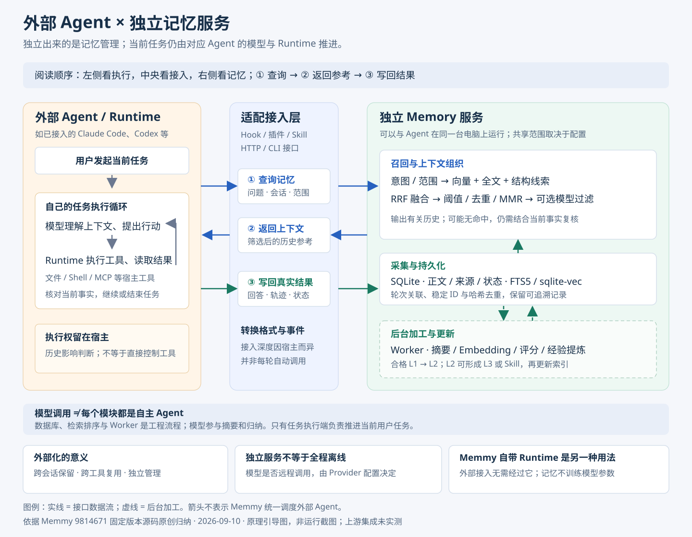

# 理解汇总：Agent 与外部记忆服务如何协作

研究日期：2026-09-10。依据 Memmy 固定提交 `98146714aad8569a298cf8692946da8bb28bf7cb`。本文整理我们的架构理解；未运行上游集成或验证记忆效果。

## 1. 对“还是 Agent 那一套，只是提取到外部”的准确表达

这个理解抓住了“能力独立出来”的方向。更准确地说：**Memmy 将记忆的采集、保存、整理、检索和更新组织为独立服务，供 Agent 接入；Agent 原有的任务执行循环仍由对应 Runtime 负责。** 它还提供自己的 Agent Runtime，可作为另一种使用方式。

需要区分“架构上独立”与“历史上从某个 Agent 拆代码”。前者是本研究的结构归纳，后者不能仅凭模块划分推断。Memmy 也不是 Mnemosyne 的二次封装。

独立记忆服务不是简单的数据库外接：适配器处理宿主差异，记忆服务管理记录的完整生命周期，模型负责其中部分摘要、筛选和经验归纳，固定程序负责持久化、检索编排与后台任务。

## 2. 外部接入整体架构图

图 1：本研究依据固定版本源码原创绘制的外部接入引导图，非产品截图。箭头表示接口数据流，不代表 Memmy 取得外部 Agent 的控制权。[放大查看](../assets/external-memory-architecture.svg)。

## 3. 三个部分各自负责什么

| 部分 | 职责 | 不应从中推断的能力 |
| --- | --- | --- |
| Agent 与 Runtime | 组织当前任务；结合模型输出选择和执行工具；接收工具结果并继续或结束 | 仅有长期记忆就能保证执行正确 |
| 适配接入层 | 将宿主事件、会话格式及工具调用转换为记忆服务请求；接收上下文；采集结果 | 所有宿主拥有一致的自动采集和召回深度 |
| 独立 Memory 服务 | 管理正文、来源、状态、全文和向量索引；召回筛选；后台提炼和反馈更新 | 提供上下文就能自动迁移环境或统一调度外部 Agent |

这里的“独立”首先表示职责、存储和接口边界。官方默认服务运行在本机，外部于 Agent 的临时对话状态，并不要求部署到另一台服务器。摘要、Embedding 或过滤是否调用远程模型，另由 Provider 配置决定。

## 4. 一次任务怎么走

1. 用户向原 Agent 提出任务。宿主按自己的集成策略触发查询：可能来自 Hook、插件，也可能来自 Skill 或显式调用。
2. 适配层携带当前问题和会话等信息，调用记忆服务。支持回合接口的路径可以使用 `turn.start`；普通搜索也可独立进行。
3. 记忆服务筛选历史并返回上下文。宿主决定如何将材料送入自己的模型请求；有些入口可以没有命中。
4. 原 Agent 继续模型与工具循环，核对当前仓库、配置和实际结果。记忆内容会影响模型判断，但这属于信息影响，不是记忆服务直接取得工具执行控制权。
5. 完成后，适配采集或显式调用将真实结果写回。支持生命周期的路径可使用 `turn.complete`；开始召回本身不等于已经保存最终对话。
6. Worker 根据配置异步总结、索引、评分和提炼。后续任务可以查询这些材料，是否进入召回仍取决于处理状态、检索范围和筛选条件。

这是一条外部接入的典型逻辑路径，不能把它当成每个宿主的统一实现。接口细节见[请求生命周期](04-request-lifecycle.md)。

## 5. 为什么内部调用模型，不等于整个模块都是 Agent

| 内部工作 | 主要机制 | 如何理解 |
| --- | --- | --- |
| 保存、哈希去重、读取状态 | 数据库与确定性程序 | 普通工程流程，无需模型自主规划 |
| 多路检索、RRF、MMR | 检索与排序算法 | 按配置计算和选择候选 |
| 摘要、查询提取、候选过滤、规则归纳 | 模型调用与结构化结果处理 | 使用模型能力的工作流；单次调用不足以证明它是自主 Agent |
| 排队、重试、后台加工 | 持久化 Worker 和任务状态 | 后台调度，与用户任务执行循环不同 |
| 当前任务的模型—工具循环 | 对应 Agent Runtime | 推进真实任务，处理工具输出并判断下一步 |

因此，“模型调用 + 工具/数据库”是可以复用的技术组合；判断一个模块是否承担 Agent 角色，还要看它是否负责目标推进、行动选择与执行闭环。这里强调的是职责，不为所有“Agent”术语规定唯一标准。

## 6. 外部化的意义和前提

- **跨会话保留**：历史不随当前上下文窗口结束而消失。
- **跨工具复用**：已接入的 Agent 可以在配置允许的范围内查询同一记忆库。
- **独立管理**：记忆的来源、版本、状态、修订和加工进度可以单独观察。
- **后台处理**：摘要、向量化和提炼不必全部挤在当前任务的同步执行中。

这些收益需要采集覆盖、记录质量、检索相关性和宿主接入共同成立。仅仅把聊天记录放进数据库，还不足以形成有效的记忆闭环。

## 7. 与自带 Agent、Mnemosyne 的关系

外部接入图聚焦“保留原 Agent，接入 Memory”。如果改用 Memmy 自带 Runtime，任务执行端随之改变；共享记忆的职责仍可单独理解。自带 Runtime 不是外部接入必须经过的中间节点。

Mnemosyne 同样有记忆组件、服务和集成能力。我们所说 Memmy 的“更多封装”，指其产品覆盖面包括更多适配、后台管理和自带 Agent，不表示前者完全没有服务或自动化，也不表示后者已经证实效果更好。详见[对照研究](03-mnemosyne-comparison.md)。

## 固定版本依据

- [Memory 总体行为](https://github.com/MemTensor/memmy-agent/blob/98146714aad8569a298cf8692946da8bb28bf7cb/docs/en/memory/overview.mdx)：默认本地服务、共享存储与回合流程。
- [宿主接入差异](https://github.com/MemTensor/memmy-agent/blob/98146714aad8569a298cf8692946da8bb28bf7cb/docs/en/memory/sources.mdx)：不同 Hook / 插件 / Skill 的行为。
- [检索算法](https://github.com/MemTensor/memmy-agent/blob/98146714aad8569a298cf8692946da8bb28bf7cb/Memory/src/algorithm/plugin-algorithms.ts)：算法与模型辅助处理。
- [后台任务](https://github.com/MemTensor/memmy-agent/blob/98146714aad8569a298cf8692946da8bb28bf7cb/Memory/src/service/worker/job-handlers.ts)：异步加工职责。
- [Memmy Runtime 循环](https://github.com/MemTensor/memmy-agent/blob/98146714aad8569a298cf8692946da8bb28bf7cb/App/memmy-agent/src/core/agent-runtime/loop.ts)：独立的任务执行机制。

[记忆内部原理](06-memory-mechanism.md) · [返回项目](../README.md)
