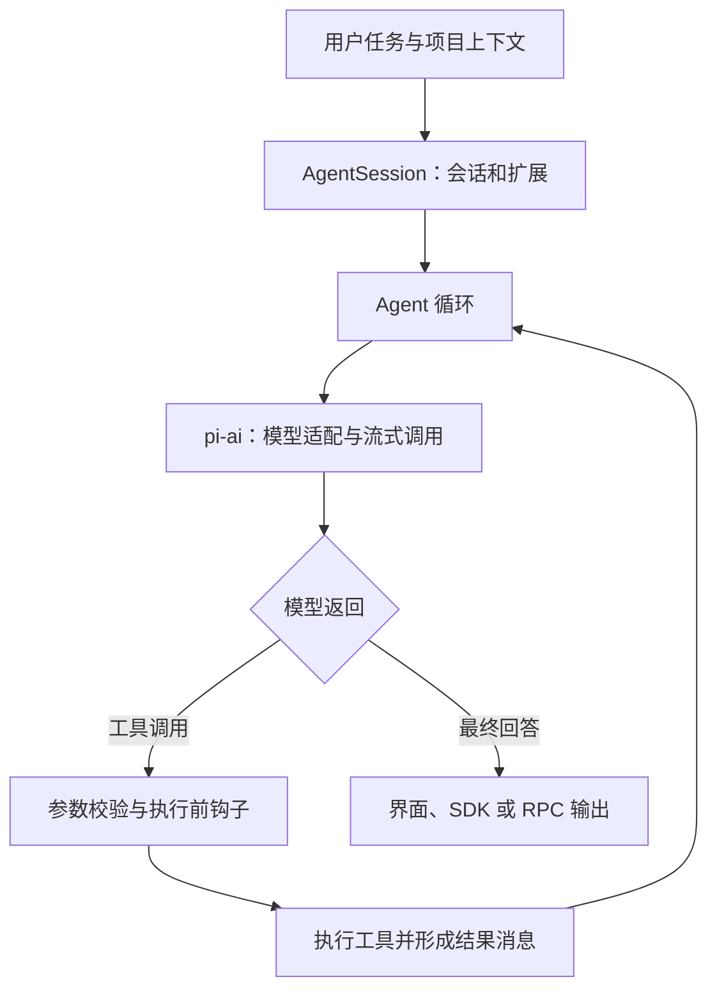

# Pi：能力、技术原理、使用场景与扩展方向

研究日期：2026-09-10。研究提交：`400d6905ce46ec46e79da8a7701b1b48850192df`；coding-agent 包声明版本 0.85.1。依据官方文档与部分核心源码静态阅读，未进行实际模型调用。

## 1. 能力是什么

Pi 是围绕大模型建立的 Agent 运行框架（agent harness），组织模型、上下文、工具、状态和交互。可以直接运行终端编程助手，也可以只引用需要的底层包。[项目入口](https://github.com/earendil-works/pi/blob/400d6905ce46ec46e79da8a7701b1b48850192df/README.md)

| 核心模块 | 职责 | 复用方式 |
| :--- | :--- | :--- |
| pi-ai | 多供应商接口、流式消息、工具描述、认证、用量信息 | 只需要模型 API 时单独引用 |
| pi-agent-core | 状态、模型与工具的循环、事件、取消及输入队列 | 构建有业务工具的 Agent |
| pi-coding-agent | 编程工具、会话、上下文整理、扩展及交互 | CLI 或 SDK/RPC |
| pi-tui | 终端组件、输入、差分渲染 | 自定义终端应用 |

此外，Chord 提供独立的插件与服务组成、复制状态和远程服务边界；pi-telemetry 提供诊断契约与参考实现。这些不等于现成 Web 平台或监控后台，上表也不是所有包的穷尽清单。[Chord](https://github.com/earendil-works/pi/blob/400d6905ce46ec46e79da8a7701b1b48850192df/packages/chord/README.md) · [Telemetry](https://github.com/earendil-works/pi/blob/400d6905ce46ec46e79da8a7701b1b48850192df/packages/telemetry/README.md)

默认编程工具是 `read`、`write`、`edit`、`bash`，可组合成“阅读代码—修改文件—运行测试—根据结果修复”。仓库另有 grep、find、ls 和 PowerShell 工具定义，是否启用取决于配置与使用方式。[工具源码](https://github.com/earendil-works/pi/blob/400d6905ce46ec46e79da8a7701b1b48850192df/packages/coding-agent/src/core/tools/index.ts)

模型层统一调用与消息格式，支持多家供应商和兼容端点。视觉、推理、缓存和工具调用效果仍取决于具体模型与端点。[pi-ai](https://github.com/earendil-works/pi/blob/400d6905ce46ec46e79da8a7701b1b48850192df/packages/ai/README.md)

程序接入有交互终端、一次性文本或 JSON 事件输出、标准输入输出 JSONL RPC、TypeScript SDK。RPC 适合由其他语言进程驱动，SDK 适合嵌入 Node.js 应用。[SDK](https://github.com/earendil-works/pi/blob/400d6905ce46ec46e79da8a7701b1b48850192df/packages/coding-agent/docs/sdk.md) · [RPC](https://github.com/earendil-works/pi/blob/400d6905ce46ec46e79da8a7701b1b48850192df/packages/coding-agent/docs/rpc.md)

| 能力 | 本版本定位 |
| :--- | :--- |
| 会话恢复、分支、上下文压缩 | coding-agent 现有功能 |
| Skills、模板、主题、TypeScript 扩展、npm/git 分发 | 现有扩展机制 |
| 子 Agent、规划模式 | 默认不内置，已有官方示例 |
| MCP | 默认不内置，可通过扩展接入 |
| 文件系统、进程、网络、凭据隔离 | 没有内置完整限制系统，需要外部隔离 |
| 项目资源信任 | 有，控制项目配置和扩展等资源加载 |
| 企业多租户、任务调度、完整业务流程 | 本次未验证为现成功能 |

项目资源信任与运行权限是两个层次：允许加载扩展，不代表其文件或网络访问受到隔离。[coding-agent](https://github.com/earendil-works/pi/blob/400d6905ce46ec46e79da8a7701b1b48850192df/packages/coding-agent/README.md) · [隔离说明](https://github.com/earendil-works/pi/blob/400d6905ce46ec46e79da8a7701b1b48850192df/README.md#permissions--containerization)

## 2. 技术原理是什么

### 2.1 模型与工具形成闭环

运行时保留 AgentMessage，调用模型前由 `transformContext` 整理，再通过 `convertToLlm` 转换。这让业务状态和只用于 UI 的消息不必全部进入模型上下文。[Agent 消息设计](https://github.com/earendil-works/pi/blob/400d6905ce46ec46e79da8a7701b1b48850192df/packages/agent/README.md)

模型输出工具名称与参数后，运行时查找工具、校验、经过执行前钩子、执行并追加结果，再请求模型。工具可并行或顺序执行；一个要求顺序的工具可让整个批次顺序执行。完成事件可以按执行完成顺序发出，历史中的工具结果仍保留模型调用顺序。源码还会拒绝执行因输出 token 上限而可能参数残缺的工具调用。[循环源码](https://github.com/earendil-works/pi/blob/400d6905ce46ec46e79da8a7701b1b48850192df/packages/agent/src/agent-loop.ts)

这是“根据观察结果决定下一步”的闭环。质量来自模型、工具和上下文共同作用，存在循环并不保证任务成功。

### 2.2 模型适配与事件

pi-ai 用统一 Context、Message、Tool 表示上层请求，适配器处理不同协议。TypeBox 描述并支持校验工具参数；文本、工具调用等以流式事件传递，界面可持续更新。[模型与工具](https://github.com/earendil-works/pi/blob/400d6905ce46ec46e79da8a7701b1b48850192df/packages/ai/README.md)

跨模型切换依靠消息转换；不能推断所有模型能力相同，也不能推断已有自动最优路由。预算策略、路由与效果评估仍需应用层实现。

### 2.3 会话树与压缩

CLI 会话保存在 JSONL 中，条目以 id/parentId 形成树，从旧节点继续可以保留不同尝试路线。[会话格式](https://github.com/earendil-works/pi/blob/400d6905ce46ec46e79da8a7701b1b48850192df/packages/coding-agent/docs/session-format.md)

接近上下文限制时，压缩机制把旧消息变成摘要，保留近期消息，追加摘要及保留边界，再重建下一轮上下文。完整历史仍在文件内，但模型每次看到的是有限上下文。摘要有损，不能等同于永久准确记忆。[压缩机制](https://github.com/earendil-works/pi/blob/400d6905ce46ec46e79da8a7701b1b48850192df/packages/coding-agent/docs/compaction.md)

会话分支管理对话历史；文件恢复需要单独的 Git checkpoint 或工作区快照，不能推断切换会话节点已经回滚文件。

### 2.4 扩展分为不同层次

| 层次 | 改变什么 | 例子 |
| :--- | :--- | :--- |
| Prompt Template | 一次任务的提示词 | 固定格式代码审查 |
| Skill | 按需加载的步骤、参考和脚本说明 | 团队测试或研究方法 |
| TypeScript Extension | 工具、命令、事件、模型与 UI | 内部查询工具、业务确认 |
| Pi Package | 通过 npm/git 分享上述资源及主题 | 团队统一工具包 |

Skills 提供任务方法，Extensions 可以改变运行时行为。扩展通过 jiti 加载 TypeScript；context 钩子可整理消息，tool_call 可拦截执行。扩展自身具有进程权限，钩子不构成针对恶意扩展的隔离边界。[Skills](https://github.com/earendil-works/pi/blob/400d6905ce46ec46e79da8a7701b1b48850192df/packages/coding-agent/docs/skills.md) · [Extensions](https://github.com/earendil-works/pi/blob/400d6905ce46ec46e79da8a7701b1b48850192df/packages/coding-agent/docs/extensions.md)

### 2.5 终端渲染

pi-tui 将界面组织为组件，仅更新变化的行或视口区域，配合同步输出与流式事件刷新消息、工具结果和状态。图片显示依赖终端协议支持。[TUI](https://github.com/earendil-works/pi/blob/400d6905ce46ec46e79da8a7701b1b48850192df/packages/tui/README.md)

## 3. 使用场景是什么

下表是基于机制的适用性判断，不是本次实测案例。

| 场景 | 使用方式 | 仍需补充 |
| :--- | :--- | :--- |
| 代码阅读、修复、重构 | 直接使用 coding-agent | 模型配置、测试和结果检查 |
| 团队开发流程 | Skills、模板固化规范，扩展连接工具 | 规范维护、权限和版本管理 |
| 内部业务助手 | agent-core 注册查询、计算、报告工具 | 数据连接、身份和业务校验 |
| IDE、桌面或 Web Agent | SDK 嵌入或 RPC 驱动 | 界面、部署、认证、并发与会话管理 |
| 内网模型工作站 | 支持的兼容端点或 llama.cpp 接入 | 部署、硬件、工具调用质量验证 |
| Agent 机制研究 | 比较提示词、工具、模型和压缩策略 | 评测集与可重复实验 |

对本研究仓库，可探索“接收 GitHub 地址—固定版本—提取能力与代码证据—生成中文分析—按模板更新索引”。Pi 提供执行基础，网页检索、来源规范和质量验收需自行提供。

只需要模型调用时可用 pi-ai；要操作本地代码可用 coding-agent；要构建特定业务 Agent 可用 agent-core 加业务工具。

## 4. 可扩展方向是什么

以下优先级属于本研究建议。

| 方向 | 现有基础 | 需要开发 | 建议顺序 |
| :--- | :--- | :--- | :--- |
| 团队/行业工具包 | Skills、Extensions、Pi Packages | 业务步骤、工具、输出模板 | 先做 |
| 知识检索与研究助手 | 自定义工具、上下文钩子 | 检索、索引、引用、版本和权限过滤 | 先做 |
| 自动模型路由 | 多模型接口与切换 | 任务/预算策略、降级和效果统计 | 中期 |
| 多 Agent | 官方 subagent 示例 | 分工、依赖、并发、文件冲突处理 | 中期 |
| MCP | 扩展注册工具 | MCP 客户端、工具映射与连接管理 | 按需 |
| IDE/Web/桌面界面 | SDK、RPC、服务组成相关包 | 前端、认证、断线与部署 | 中期 |
| 企业隔离与审计 | 工具钩子、执行替换、telemetry 契约 | 沙箱、凭据隔离、审计、审批 | 面向团队服务时优先 |
| 长期记忆与评测 | 会话、压缩扩展点、事件与用量 | 检索存储、更新规则、任务集与评分 | 后续深化 |

官方 [subagent 示例](https://github.com/earendil-works/pi/blob/400d6905ce46ec46e79da8a7701b1b48850192df/packages/coding-agent/examples/extensions/subagent/README.md) 使用独立 Pi 进程和上下文，展示并行流式输出、用量和中止；上下文隔离不等同于文件系统隔离。

官方 [plan-mode 示例](https://github.com/earendil-works/pi/blob/400d6905ce46ec46e79da8a7701b1b48850192df/packages/coding-agent/examples/extensions/plan-mode/README.md) 展示禁用内置写工具、命令过滤、计划提取和进度跟踪；是否满足完整只读要求仍取决于其他工具与扩展。

长期记忆需要事实更新和冲突规则，多 Agent 需要处理协作成本与产物合并。它们不能仅靠增加提示词完成。

## 5. 借鉴价值与后续验证

值得借鉴的四点：按层复用模型和 Agent；用工具闭环连接真实工作；通过会话树保存探索历史；用扩展接口承载工作流程变化。

后续最小验证建议：

1. 在专用目录验证读取、修改、测试的完整闭环。
2. 从同一会话节点测试两种方案，确认对话分支与文件状态边界。
3. 开发一个有参数校验的查询工具，验证失败反馈。
4. 用长任务验证压缩后关键约束是否保留。
5. 对不同模型记录任务成功率、成本和时延，再决定是否增加路由或多 Agent。

本次未执行上述实验，不对成功率、效率提升、成本节省或生产成熟度给出数值结论。
