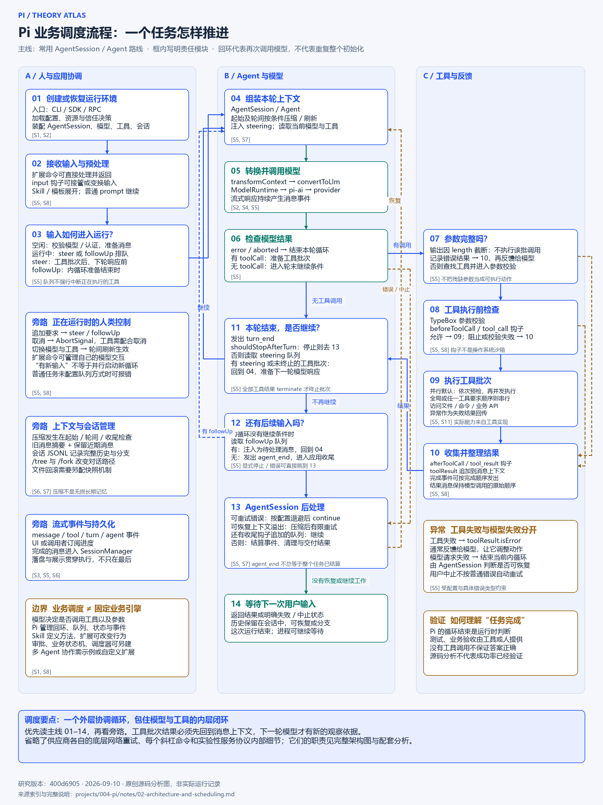

# Pi 完整架构与业务调度：理论分析与双图

研究日期：2026-09-10。固定提交：`400d6905ce46ec46e79da8a7701b1b48850192df`。coding-agent 包声明版本 0.85.1。

本篇研究解释“有哪些模块、模块如何协作、一次任务怎样被调度”。依据官方文档及关键源码静态阅读；未执行上游 Pi、没有真实模型调用或运行性能结论。图为本研究原创，以功能与控制关系表达架构，不是逐项 npm 依赖锁定图。

## 1. 先看完整架构

图 1：固定版本的技术能力与模块关系。[打开可缩放 SVG](../assets/architecture.svg) · [PNG 原图](../assets/architecture.png)。来源：下文 S1–S18 对应的官方文档和源码；本研究原创整理。

建议从上到下阅读左侧常用路径，再看底部实验性服务路线，最后看右侧横切能力。

### 谁负责什么

| 参与者 | 决策与职责 | 不应混淆的边界 |
| :--- | :--- | :--- |
| 人 / 应用 | 任务目标、输入、约束与验收标准 | 可以给出显式流程，但默认任务不一定有预设步骤图 |
| 大模型 | 根据上下文生成回答、工具名称与参数 | 不直接拥有运行环境中的文件和 Shell |
| Pi 运行时 | 组装上下文、执行工具、管理队列、事件、会话与恢复 | 运行结束不证明业务正确 |
| 工具实现 | 访问文件、进程、业务服务，产生实际结果 | 访问范围由执行环境及业务授权决定 |
| Skill / 扩展 | 方法指导；新增工具、事件、命令与界面 | Skill 是方法资源，Extension 是可执行模块，两者不同 |
| 宿主应用 | 安全隔离、凭据、部署、业务状态与生命周期策略 | 项目信任不能替代操作系统隔离 |

### 常用路线的五层

1. **接入与呈现。** 交互 CLI、Print/JSON、TypeScript SDK 和 JSONL RPC。pi-tui 提供终端呈现；它不负责替模型决定下一步。来源 S1–S3、S10。
2. **应用协调。** createAgentSession 装配 SettingsManager、ResourceLoader、ModelRuntime、SessionManager 和 Agent；AgentSession 再协调输入、扩展、压缩、重试和事件。来源 S2、S5。
3. **执行循环。** Agent 管理 model、systemPrompt、tools、messages 等状态；agent-loop 将模型调用和工具批次组织成可继续的循环。来源 S5。
4. **模型与工具两个出口。** pi-ai 适配供应商协议并返回流式事件；工具执行器校验并运行工具，把成功或失败结果追加到上下文。来源 S4、S5、S11。
5. **外部环境。** 模型服务与文件系统、Shell、业务 API。业务工具可能自身调用模型或网络，但这种行为由具体工具实现决定，不能从工具名推断。

### 包覆盖与成熟度

本图覆盖该提交下的 **11 个组件包**（包括嵌套的 SQLite 后端包），避免只把根 README 的主要包列表当成整个架构。

| 目录 / 包 | 角色 | 路线与边界 | 来源 |
| :--- | :--- | :--- | :--- |
| packages/ai | 多模型 API、消息、流式事件、工具模式、用量 | 常用模型层；功能受供应商支持限制 | S4 |
| packages/agent | Agent 循环与状态；亦包含新 Session/Harness 相关接口 | 常用 Agent 与新接口应按具体入口区分 | S5、S14、S16 |
| packages/coding-agent | 编程助手、AgentSession、SDK、CLI/RPC、资源管理 | 常用主线；另有实验性集成代码 | S1、S2、S5 |
| packages/tui | 终端组件和差分渲染 | 呈现层 | S10 |
| packages/chord | 插件 facets、服务依赖、绑定、状态复制、取消上下文 | 独立通用包；参与新的服务组成机制 | S15 |
| packages/telemetry | 诊断契约、类型化 schema、参考适配器 | 横切诊断；不是现成遥测服务或后台 | S17 |
| packages/evals | 基于真实 AgentSession 的行为评测 | 开发验证，不是每次任务的必经步骤 | S18 |
| packages/client | 传输无关客户端、请求订阅与呈现挂接 | 明确实验性；断线不会自动重连并重放请求 | S12 |
| packages/protocol | 路由信封、CBOR、字节流分帧 | 明确实验性，无兼容性保证；不是 JSONL RPC | S13 |
| packages/server | 本地路由与多呈现挂接 | 明确实验性；业务服务和生命周期由宿主提供 | S14 |
| packages/session-backends/sqlite-node | 基于 node:sqlite 的 Session 后端 | 可选持久化；不能据此把 CLI JSONL 改写成 SQLite | S16 |

### 两条容易混淆的接入路线

**常用集成路线：** 其他程序 → 标准输入输出 JSONL RPC → coding-agent；或在 Node.js 内直接调用 SDK。

**实验性服务路线：** 自定义呈现 → pi-client → pi-protocol 路由与帧 → pi-server → 应用持有的 Session / Harness。Chord 定义服务调用和复制状态的语义；协议层负责信封和严格 JSON 边界。Session 与 Harness 对象本身留在拥有它们的进程里。SQLite 可以提供持久化，但服务路由不强制所有应用使用同一后端。

实验传输未提供完整对端认证，宿主还须承担授权、生命周期和写入所有权。多呈现连接同一会话也不等于已经具有多 Agent 分工协作。

## 2. 再看业务调度流程

图 2：常用 AgentSession / Agent 路线的控制流程。[打开可缩放 SVG](../assets/scheduling-flow.svg) · [PNG 原图](../assets/scheduling-flow.png)。图中的三条泳道表示职责，不表示三个必定独立的进程或线程。

### 主流程与控制条件

| 节点 | 输入与操作 | 决定下一步的主体 |
| :--- | :--- | :--- |
| 01 初始化 | 创建或恢复会话，加载资源，选择模型与工具 | 入口和应用配置 |
| 02 输入预处理 | 优先处理扩展命令；input 钩子接管或变换；展开 Skill/模板 | AgentSession 与扩展 |
| 03 输入路由 | 空闲时准备 prompt；运行中按指定方式放入队列 | AgentSession |
| 04 轮次准备 | 按条件压缩，取最新模型、工具、提示词与消息，注入 steering | AgentSession + Agent |
| 05 模型调用 | transformContext → convertToLlm → ModelRuntime / pi-ai / provider | 运行时适配，模型生成 |
| 06 响应分流 | 错误/中止走收尾；有 toolCall 走工具路径；无调用走轮末判断 | Agent 循环检查模型结果 |
| 07 截断保护 | 因 length 停止时，不执行可能残缺的工具调用，形成错误结果 | Agent 循环 |
| 08 工具预检 | 查找工具、校验参数、执行 beforeToolCall；拒绝不进入真实执行 | 工具模式及扩展策略 |
| 09 工具执行 | 顺序或并行调度；外部动作产生可观察结果 | 工具执行器与工具实现 |
| 10 结果回传 | 后处理结果，追加 toolResult，保留 isError 等信息 | Agent 循环与钩子 |
| 11 轮末判断 | turn_end；检查显式停止、steering 与工具继续条件 | Agent 循环 |
| 12 后续队列 | 内循环准备停止时才取 followUp；有消息则继续 | Agent 外层循环 |
| 13 应用后处理 | 可恢复错误重试、上下文恢复、处理收尾中新入队的消息 | AgentSession |
| 14 结算交付 | 没有继续工作时清理并返回，之后等待下一次输入 | AgentSession / 入口 |

### 关键的时序细节

- **一次用户任务可以包含多次模型调用。** 一轮通常包含一次模型响应和它提出的工具批次；整次任务还可能包含后续队列与恢复。不要把 message、turn、agent run、完整会话视作同一层次。
- **steering 不抢占正在执行的工具。** 它在工具批次结束后、下一次模型响应前进入上下文；轮次准备期间入队也有补充检查。
- **followUp 比 steering 更晚。** 当工具和 steering 驱动的内循环准备结束时，才检查它。
- **before_agent_start 是任务启动阶段的扩展钩子。** 不应把它描述成每次工具后的模型调用必定重复触发；轮次刷新另有 prepareNextTurn 与上下文转换。
- **并行不是预检也同时运行。** 默认并行模式先依次预检，再并发执行已允许的工具。只要批次内有工具要求顺序，就走顺序路径。完成事件按完成时机通知，最终结果消息仍按模型原始调用顺序组织。
- **terminate 是批次级继续提示。** 全部已最终确定的工具结果均设置 terminate 才终止这一批次的自动后续模型调用；混合批次仍可继续，steering/followUp 也可能导致继续。
- **agent_end 不必然表示调用者可以最终收工。** AgentSession 还能判断可恢复错误、压缩恢复和收尾新增队列，再决定是否 continue。事件监听与最终结算有自己的完成边界。
- **记录与显示贯穿执行。** 流式事件驱动 UI 和调用者观察，完成消息持续进入会话管理，不能只在流程最后才画一次“保存”。

### 三类失败的处理不同

| 情况 | 典型处理 | 不应推断 |
| :--- | :--- | :--- |
| 工具参数或执行失败 | 返回失败工具结果；模型可选择修正或其他动作 | 任意工具失败都触发网络重试 |
| 模型请求可重试错误 | 当前底层运行结束后，AgentSession 按设置退避并继续；供应商层可能另有网络重试 | 所有错误都无限重试 |
| 上下文溢出或可恢复截断 | 特定条件下压缩并有限恢复，失败则暴露错误 | 压缩必定成功或保留全部语义 |
| 用户中止 | AbortSignal 传播，合作式取消；返回中止状态 | 中止自动当作普通失败重新运行 |
| 输入未配置模型或认证 | prompt 预检报错，不进入正常模型调用 | 一定能进入工具循环 |

“业务调度”在本图中指 Agent 任务运行控制。Pi 默认没有替每个业务预先定义完整的审批图、定时调度器或持久化业务状态机。需要这些机制时，可由应用、扩展或外部系统提供。

## 3. 用一个例子串起来

以“修复购物车数量为零时的计算错误”为例：

人给出目标与约束 → 模型决定先读文件 → Pi 校验并执行 read → 文件内容进入下一轮上下文 → 模型提出修改 → edit 返回结果 → 模型提出测试命令 → bash 返回测试结果 → 模型组织结论 → Pi 检查队列与恢复条件 → 返回给人。

这里“读文件还是测试”由模型结合上下文选择，“工具能否执行、在哪里执行、结果怎样回传”由运行时与环境控制，“是否真的修好”由测试和业务验收证明。这个例子只解释机制，本次未实际运行。

## 4. 原始来源索引

下列链接全部固定到研究提交。图中的 S 编号引用这些来源。

| 编号 | 资料 | 支撑内容 |
| :--- | :--- | :--- |
| S1 | [coding-agent README](https://github.com/earendil-works/pi/blob/400d6905ce46ec46e79da8a7701b1b48850192df/packages/coding-agent/README.md) · [仓库入口](https://github.com/earendil-works/pi/blob/400d6905ce46ec46e79da8a7701b1b48850192df/README.md) | 接入方式、资源、功能哲学、权限边界 |
| S2 | [sdk.ts](https://github.com/earendil-works/pi/blob/400d6905ce46ec46e79da8a7701b1b48850192df/packages/coding-agent/src/core/sdk.ts) · [SDK 文档](https://github.com/earendil-works/pi/blob/400d6905ce46ec46e79da8a7701b1b48850192df/packages/coding-agent/docs/sdk.md) | 组件装配与 ModelRuntime、AgentSession 关系 |
| S3 | [RPC 文档](https://github.com/earendil-works/pi/blob/400d6905ce46ec46e79da8a7701b1b48850192df/packages/coding-agent/docs/rpc.md) | stdin/stdout JSONL、事件接入 |
| S4 | [pi-ai 文档](https://github.com/earendil-works/pi/blob/400d6905ce46ec46e79da8a7701b1b48850192df/packages/ai/README.md) | 多模型适配、消息、工具与事件 |
| S5 | [agent-loop.ts](https://github.com/earendil-works/pi/blob/400d6905ce46ec46e79da8a7701b1b48850192df/packages/agent/src/agent-loop.ts) · [agent.ts](https://github.com/earendil-works/pi/blob/400d6905ce46ec46e79da8a7701b1b48850192df/packages/agent/src/agent.ts) · [agent-session.ts](https://github.com/earendil-works/pi/blob/400d6905ce46ec46e79da8a7701b1b48850192df/packages/coding-agent/src/core/agent-session.ts) | 执行循环、队列、工具、停止、重试、消息记录 |
| S6 | [会话格式](https://github.com/earendil-works/pi/blob/400d6905ce46ec46e79da8a7701b1b48850192df/packages/coding-agent/docs/session-format.md) | JSONL、树、分支、摘要条目 |
| S7 | [压缩机制](https://github.com/earendil-works/pi/blob/400d6905ce46ec46e79da8a7701b1b48850192df/packages/coding-agent/docs/compaction.md) | 起始、轮间和恢复中的压缩 |
| S8 | [扩展文档](https://github.com/earendil-works/pi/blob/400d6905ce46ec46e79da8a7701b1b48850192df/packages/coding-agent/docs/extensions.md) | 工具、命令、UI、执行钩子 |
| S9 | [Skills 文档](https://github.com/earendil-works/pi/blob/400d6905ce46ec46e79da8a7701b1b48850192df/packages/coding-agent/docs/skills.md) | 按需加载方法与资源 |
| S10 | [pi-tui 文档](https://github.com/earendil-works/pi/blob/400d6905ce46ec46e79da8a7701b1b48850192df/packages/tui/README.md) | 终端组件、渲染与图片协议 |
| S11 | [工具注册源码](https://github.com/earendil-works/pi/blob/400d6905ce46ec46e79da8a7701b1b48850192df/packages/coding-agent/src/core/tools/index.ts) | 默认、可选和可替换工具 |
| S12 | [pi-client 文档](https://github.com/earendil-works/pi/blob/400d6905ce46ec46e79da8a7701b1b48850192df/packages/client/README.md) | 客户端、订阅、重连和呈现挂接 |
| S13 | [pi-protocol 文档](https://github.com/earendil-works/pi/blob/400d6905ce46ec46e79da8a7701b1b48850192df/packages/protocol/README.md) | 路由、CBOR 分帧、实验状态与认证边界 |
| S14 | [pi-server 文档](https://github.com/earendil-works/pi/blob/400d6905ce46ec46e79da8a7701b1b48850192df/packages/server/README.md) | 服务器路由、应用宿主与 worker 生命周期 |
| S15 | [Chord 文档](https://github.com/earendil-works/pi/blob/400d6905ce46ec46e79da8a7701b1b48850192df/packages/chord/README.md) | 插件组成、服务绑定、复制状态与上下文 |
| S16 | [SQLite 后端文档](https://github.com/earendil-works/pi/blob/400d6905ce46ec46e79da8a7701b1b48850192df/packages/session-backends/sqlite-node/README.md) | 持久化后端、写所有权和存储边界 |
| S17 | [pi-telemetry 文档](https://github.com/earendil-works/pi/blob/400d6905ce46ec46e79da8a7701b1b48850192df/packages/telemetry/README.md) | 显式诊断契约与适配 |
| S18 | [pi-evals 文档](https://github.com/earendil-works/pi/blob/400d6905ce46ec46e79da8a7701b1b48850192df/packages/evals/README.md) | 真实模型驱动的行为评测 |

## 5. 产物与验证

- 两图均提供可编辑 SVG 和高清 PNG；文字与几何图形由同一绘图源生成。
- 已逐图目视检查 PNG，修正正文与来源标记的重叠；生成器检查正文宽度和框内空间。
- 页面提供缩放、适应宽度、原图与下载；无需模型或外部服务。
- 未执行浏览器视觉与真实点击测试；没有执行上游程序。
- 图的“完整”指组件职责及关键运行控制分支覆盖，不声称展示每个函数、全部供应商适配细节或全部命令。

[返回项目](../README.md) · [已有能力分析](01-analysis.md)
