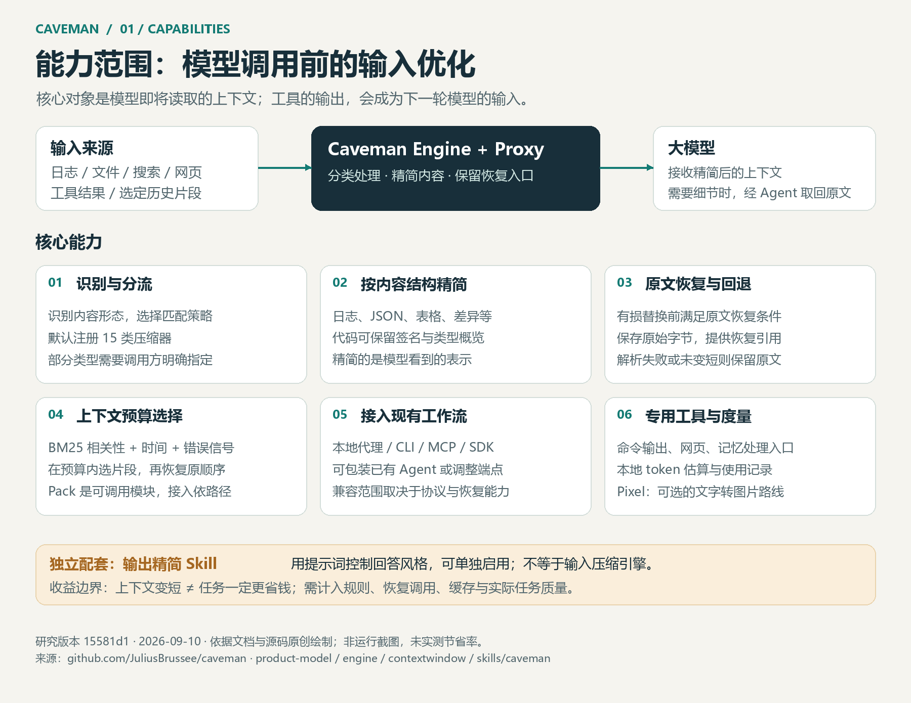
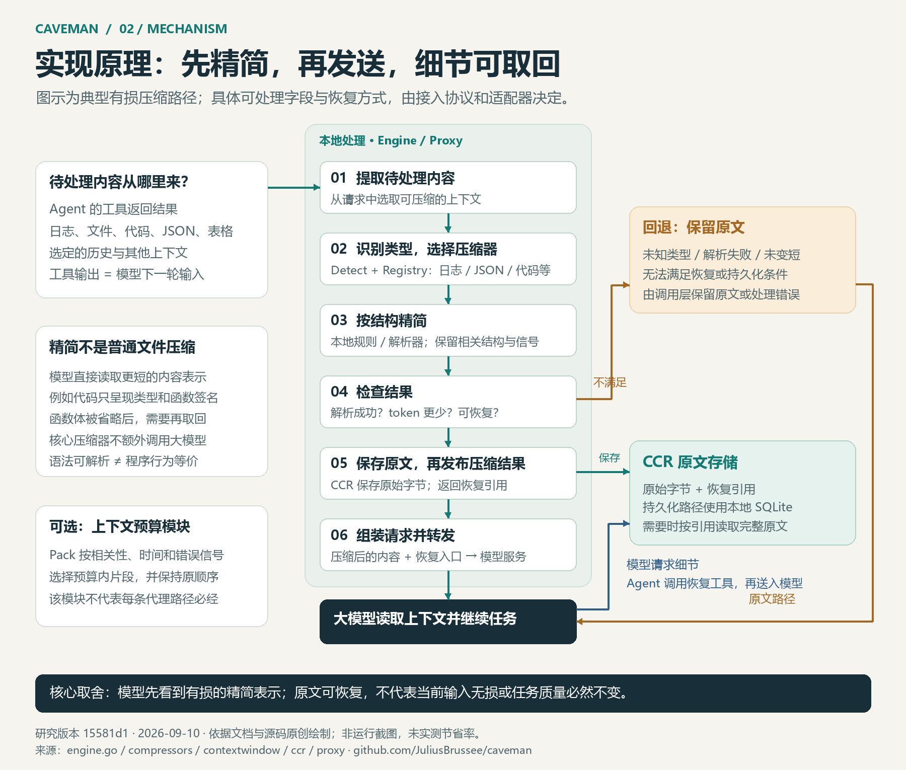

# 005 · Caveman

Caveman 的 Engine / Proxy 在模型调用前精简选定上下文，并保留原文恢复入口。仓库还提供独立的输出风格 Skill；本研究的重点是输入优化运行时。

**摘要：Caveman 在模型调用前，按内容类型精简日志、代码、JSON 等选定上下文，并提供原文恢复与不适合压缩时的回退机制。它的研究价值在于内容专用压缩规则、信息取舍和恢复设计。Codex 原生已有上下文压缩与管理，两者能力部分重合，具体实现与效果不能视为相同。本研究展示的是可选接入关系，不表示我们建议叠加使用，也不表示已经确认叠加有收益。** 详见[理解整理与原生能力对照](notes/02-native-context-and-external-guidance.md)。

## 项目资料

| 项目 | 内容 |
| :--- | :--- |
| 原始仓库 | [JuliusBrussee/caveman](https://github.com/JuliusBrussee/caveman) |
| 官方文档 | [产品架构说明](https://github.com/JuliusBrussee/caveman/blob/15581d14007fd01fb3f132016741962f34936ca2/docs/technical/product-model.md) |
| 研究版本 | `15581d14007fd01fb3f132016741962f34936ca2` |
| 上游许可证 | 分区许可：Skill、CLI、部分 SDK 为 MIT；Engine、Proxy 等为 BSL-1.1，见[许可证范围](https://github.com/JuliusBrussee/caveman/blob/15581d14007fd01fb3f132016741962f34936ca2/LICENSING.md) |
| 技术栈 | Go、SQLite、Tree-sitter / Go AST、Markdown Skill |
| 研究状态 | 文档、原生能力对照与三张解释图完成；上游及叠加收益未实测 |
| 收录日期 | 2026-09-10 |
| 最近更新 | 2026-09-10 |
| 在线演示 | — |

## 能力范围

图 1：模型输入优化能力地图。来源：依据固定版本源码与官方文档原创绘制，非产品截图；不代表所有模块每次请求都启用。[查看矢量图](assets/capability-map.svg)

## 实现原理

图 2：典型有损压缩路径及回退、恢复分支。来源：依据固定版本 Engine、压缩器、CCR 与代理源码原创绘制；未运行验证。[查看矢量图](assets/compression-flow.svg)

## 外部引导与上下文整理

图 3：外部引导、Codex 原生机制与可选 Caveman 层的关系。来源：依据 OpenAI 官方文档和 Caveman 固定版本源码原创整理，非当前部署图。[查看矢量图](assets/external-guidance-architecture.svg) · [完整对照与研究判断](notes/02-native-context-and-external-guidance.md)

图中“Codex → Caveman → 模型”仅说明可选接入方式，不表示我们建议叠加使用，也不表示已经确认叠加有收益。

## 研究摘要

- **核心能力：** 在发送模型前缩短选定上下文。工具的输出同时也是模型下一轮的输入。
- **值得借鉴：** 按类型处理、保留原文恢复入口、结果未变短则保留原文。
- **适用场景：** 大型工具结果、重复日志、仓库结构导航、长会话；实际收益需 A/B 验证。
- **限制与取舍：** 原文可恢复不等于当前输入无损；恢复调用、缓存与任务质量影响实际收益。
- **独立配套：** 回答精简 Skill 控制输出风格，可与输入压缩运行时分别使用。
- **增量价值：** 以原生 Codex 为基线，研究哪些专用规则能在保持任务质量的条件下进一步减少开销；当前没有叠加收益实测结论。
- **使用立场：** 能力部分重合不等于实现与效果相同；展示接入方式不表示我们建议叠加使用，也不表示已经确认叠加有收益。

## 笔记与实践

- [源码依据与图示边界](notes/01-diagram-evidence.md)
- [理解整理：原生上下文管理、外部引导与增量价值](notes/02-native-context-and-external-guidance.md)
- [图片来源及格式说明](assets/README.md)
- [Web 演示状态](web/README.md)

## 验证范围

完成官方文档及核心源码阅读、图示生成和图像检查。没有安装 Caveman、接入模型服务或复现实测节省率。图中不使用宣传百分比作为已验证结论。

## 来源与许可

三张图为原创结构示意图，无上游截图或代码复制。Caveman 依据固定提交的官方文档与源码，上游采用分区许可证；Codex 对照依据 2026-09-10 查阅的 OpenAI 官方文档。来源见[图示证据](notes/01-diagram-evidence.md)和[原生能力对照](notes/02-native-context-and-external-guidance.md#8-来源与验证状态)。

---

[返回总项目索引](../../README.md#项目索引)
