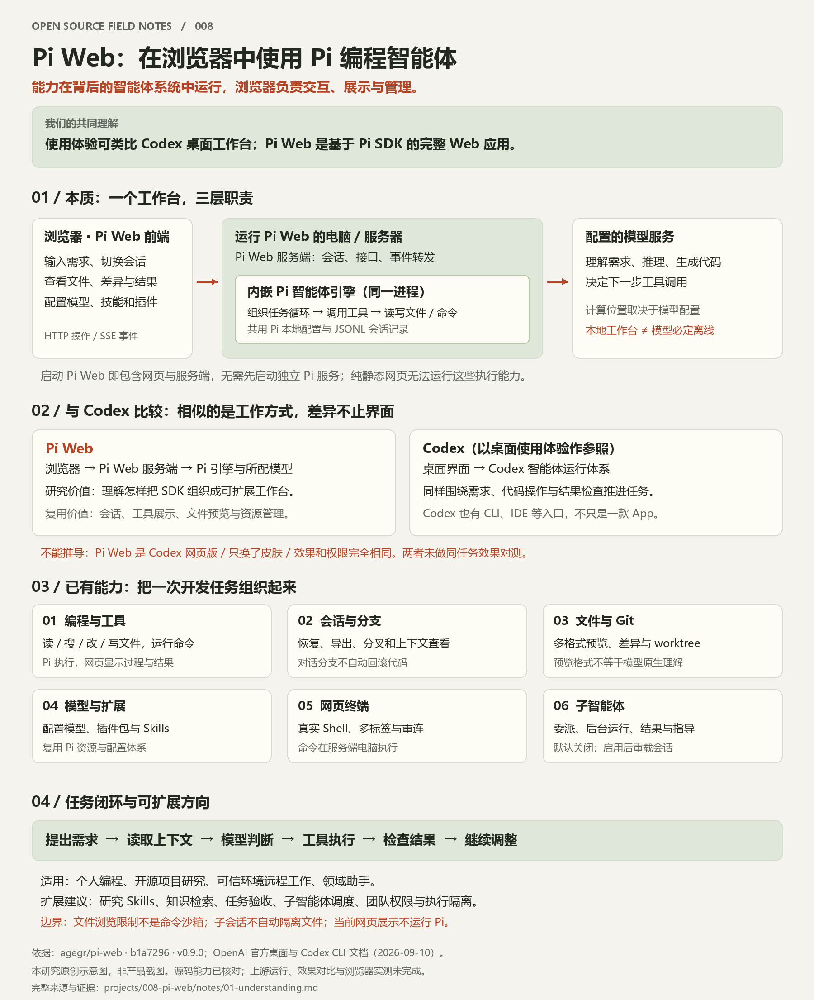
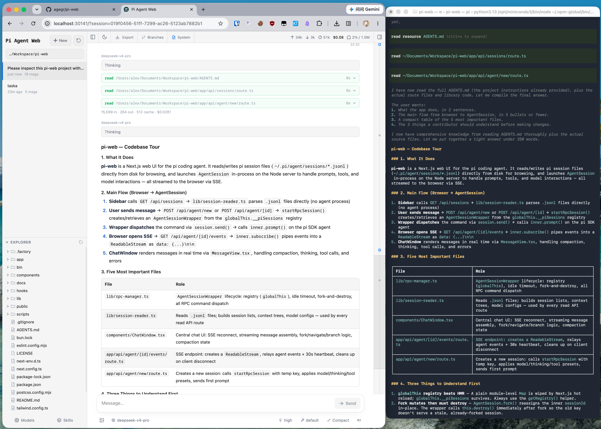

# 008 · Pi Web

把 Pi 智能体封装为可自托管的浏览器编程工作台，支持读写代码、执行命令、会话分支、文件与模型管理；与 Codex 桌面体验的比较说明界面与执行引擎的分工，可借鉴其产品组织与扩展设计，不能据此认定能力或效果等同。

**准确定位：这是包含前端与本地服务端的 Pi 应用层开发。服务端内嵌 Pi 引擎，不需要先启动独立 Pi 服务；也不是连接 Codex 的网页客户端。**

## 项目资料

| 项目 | 内容 |
| :--- | :--- |
| 原始仓库 | [agegr/pi-web](https://github.com/agegr/pi-web) |
| 官方文档 | [固定版本 README](https://github.com/agegr/pi-web/blob/b1a72962d385db4a82b93ad5802e9024d5b44874/README.md) |
| 研究版本 | `b1a72962d385db4a82b93ad5802e9024d5b44874`；提交日期 2026-09-09；package.json 版本 0.9.0 |
| 上游许可证 | [MIT](https://github.com/agegr/pi-web/blob/b1a72962d385db4a82b93ad5802e9024d5b44874/LICENSE)，© 2026 agegr |
| 技术栈 | Next.js 16.3.1、React 19、TypeScript、Tailwind CSS 4；Pi SDK 0.85.1；xterm.js、node-pty |
| 环境要求 | 上游 Node.js ≥ 22.19.0；本研究静态展示 Node.js ≥ 22，无第三方依赖 |
| 研究状态 | 固定源码研究与本地能力展示完成；上游真实任务未运行 |
| 收录日期 / 最近更新 | 2026-09-10 |
| 在线演示 | —（本地展示已提供，尚未发布验证） |

## 研究摘要

- **核心能力：** 编程工具执行、会话分支、文件与 Git 工作区、模型与资源管理、网页终端、可选子智能体。
- **技术分工：** Pi Web 接收操作并呈现事件；Pi SDK 组织智能体运行与工具调用；模型负责推理和生成。
- **适用场景：** 个人编程、开源项目研究、在可信环境远程访问开发机，以及基于 Skills 的领域助手。
- **扩展方向：** 研究模板、任务验收、子智能体协作、知识库检索与团队服务；这些是研究建议。
- **限制：** 对话分支不回滚代码；目录浏览限制不等于执行沙箱；子智能体默认关闭；文件预览不代表模型原生理解该格式。

## 完整理解总览

图 1：本研究原创总览，依据固定 Pi Web 源码、OpenAI 官方资料和本次讨论整理；非产品截图。源码能力已核对，上游运行与同任务效果对比未验证。[放大 SVG](assets/research-overview.svg) · [下载 PNG](assets/research-overview.png) · [完整文档](notes/01-understanding.md)

## 与 Codex 比较的意义

使用体验上，可以把 Pi Web 理解为浏览器中的 AI 编程工作台。技术上，它使用 Pi 引擎，不是 Codex 网页版；Codex 也有 CLI、IDE 等入口。这个比较帮助我们理解“界面、执行引擎、模型”三层分工，并识别可复用的产品设计，不证明两者能力或效果相同。

来源：[官方桌面说明](https://learn.chatgpt.com/docs/app) · [Codex CLI](https://learn.chatgpt.com/docs/codex/cli)，核对日期 2026-09-10。

## 效果与图片说明

图 2：来源为固定研究提交中的 [docs/screenshot2.png](https://github.com/agegr/pi-web/blob/b1a72962d385db4a82b93ad5802e9024d5b44874/docs/screenshot2.png)。右侧是独立桌面终端，并非网页内的终端面板。图片对应应用版本未核实；非本研究运行截图。MIT / © 2026 agegr，已保留[许可证](assets/UPSTREAM-LICENSE.txt)。

## 能力展示

中文页面包含分工图、上游截图、六类能力，以及添加登录页面、研究开源库、委派代码审查三个场景共 15 个手动演示阶段。每步说明负责角色、界面反馈和能力边界，附扩展建议、固定源码链接与笔记下载。

这是解释型静态展示；不会调用模型、读取真实项目或执行终端命令。[展示运行说明](web/README.md)

## 笔记与实践

- [完整理解：定位、能力、技术原理、场景与扩展](notes/01-understanding.md)
- [验证范围与记录](notes/02-verification.md)
- 上游引擎参照：[earendil-works/pi](https://github.com/earendil-works/pi)（本仓库另有编号 004 的本地研究）。

## 本地运行

本研究展示：在本子项目的 `web/` 目录运行 `node scripts/build.mjs`、`node scripts/check.mjs`，再运行 `node scripts/serve.mjs`。访问 `http://127.0.0.1:30148`。

上游应用运行方式（仅转录官方方法，本次未执行）：使用 Node.js ≥ 22.19.0，运行 `npx @agegr/pi-web@0.9.0`，默认访问 `http://127.0.0.1:30141`，并配置模型服务。npm 包版本是使用参考；本研究以以上 Git 提交为准，未验证该提交与发布包的逐文件一致性。

## 来源与许可

研究只保留整理后的文档、原创静态展示与一张有来源的上游截图，不引入完整上游副本或应用依赖。结论对应的源码见[研究笔记证据索引](notes/01-understanding.md#证据索引)。

---

[返回总项目索引](../../README.md#项目索引)
