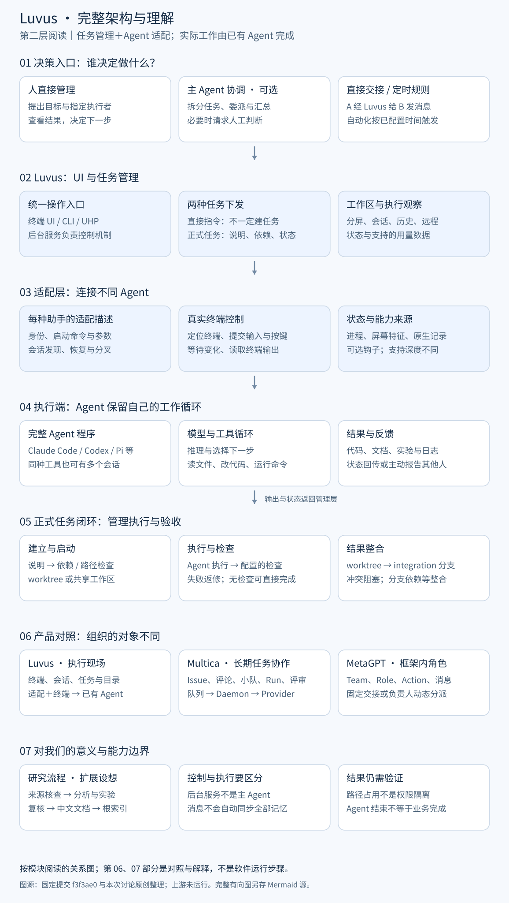

# 011 · Luvus

Luvus 是支持多 Agent 的终端工作台，通过任务管理和适配层连接已有编程助手，提供任务下发、会话管理、并行协调、检查与结果整合。对我们而言，重点是理解如何组织现成 Agent 的工作，以及如何将研究规则变成可执行的验收流程。

## 先看模块，再看细节

图 1：任务管理与适配是理解入口，实际执行由接入的 Agent 完成。来源：依据固定源码和官方文档原创绘制，非产品截图；主 Agent 可选。[放大引导图](assets/entry-guide.svg)。

[完整理解与产品对照](notes/01-understanding.md) · [详细架构与原始 Mermaid 图](notes/02-full-architecture.md) · [来源与验证](notes/03-sources-and-verification.md) · [Web 运行说明](web/README.md)

## 项目资料

| 项目 | 内容 |
| --- | --- |
| 原始仓库 | [RizRiyz/luvus](https://github.com/RizRiyz/luvus) |
| 官方文档 | [Luvus Docs](https://luvus.dev/docs/) |
| 研究版本 | [f3f3ae05e7e6ae6efe4501cca329774cf35715e1](https://github.com/RizRiyz/luvus/tree/f3f3ae05e7e6ae6efe4501cca329774cf35715e1)，2026-09-10；Cargo.toml 版本 0.13.4 |
| 上游许可证 | [Apache-2.0](https://github.com/RizRiyz/luvus/blob/f3f3ae05e7e6ae6efe4501cca329774cf35715e1/LICENSE) |
| 技术栈 | Rust、Ratatui、PTY、本地 IPC；本研究网页为无第三方运行依赖的静态页面 |
| 研究状态 | 中文研究与线上展示完成；上游未运行，验证范围见来源记录 |
| 收录日期 | 2026-09-10 |
| 最近更新 | 2026-09-10 |
| 在线演示 | [模块引导](https://yydshly.github.io/0910_codex_project/011-luvus/) · [完整理解](https://yydshly.github.io/0910_codex_project/011-luvus/understanding.html) · [详细架构](https://yydshly.github.io/0910_codex_project/011-luvus/architecture.html) |

## 我们形成的理解

- **任务管理**：定义任务、下发指令、记录状态、管理依赖、检查结果与整合分支；临时指令不一定创建正式任务。
- **Agent 适配**：统一不同工具的识别、启动、终端输入、状态观察及可用的恢复、分叉和事件能力。
- **实际执行**：接入的 Agent 保留自己的模型与工具循环；Luvus 不统一接管其内部每次工具调用。
- **多 Agent 协作**：可以由人直接管理、主 Agent 统筹或 Agent 彼此交接；主 Agent 可选，后台服务负责控制机制。
- **产品差异**：Luvus 偏执行现场；Multica 偏 Issue、团队和长期任务协作；MetaGPT 偏框架内角色与动作的实现。
- **价值边界**：状态结束不等于业务完成；路径协调不是文件权限隔离；协作不会自动共享全部记忆。

## 详细架构

图 2：讨论中的完整理解，作为第二层阅读。来源：依据固定源码与本次讨论原创整理，非实际执行轨迹。[详细读图说明](notes/02-full-architecture.md) · [Mermaid 源文件](assets/full-architecture.mmd)。

## 运行与验证

本次未安装或启动 Luvus，未配置助手凭据，也未运行多 Agent 实验。本地展示的构建和阅读方法见 [Web 说明](web/README.md)。研究正文区分源码存在、静态展示检查与扩展设想。

---

[返回总项目索引](../../README.md#项目索引)
