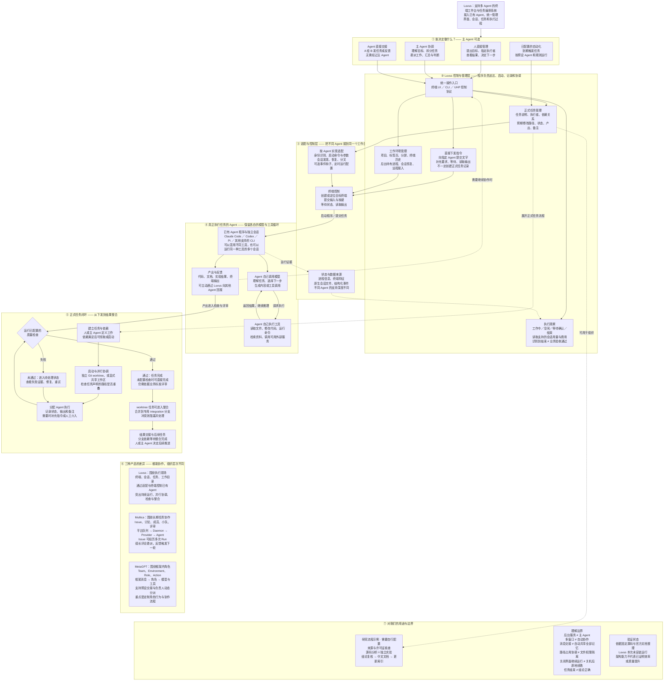

# Luvus：详细架构与读图说明

先用入口图理解“任务管理＋Agent 适配”；本页保留上一轮的详细图，按需深入。静态图按七组模块重排，完整有向关系保留在下方 Mermaid 源图中。

## 1. 完整架构的分层阅读版

图源：本研究依据固定提交 f3f3ae0 和本次讨论原创整理，非产品截图与运行轨迹。[放大 SVG](../assets/full-architecture.svg) · [下载 PNG](../assets/full-architecture.png)。

## 2. 如何阅读

- 第 1 组：人、可选主 Agent、Agent 交接或预设规则决定任务来源。后台服务不等于主 Agent。
- 第 2、3 组：Luvus 提供任务与会话管理，再通过适配和终端控制连接助手。
- 第 4 组：助手自己调用模型与工具；输出和状态返回管理层，必要时直接交接给其他助手。
- 第 5 组：正式任务的依赖、执行、检查与整合闭环；无检查可直接完成，共享工作区没有独立合并步骤。
- 第 6、7 组：产品对照和研究用途，是解释层，不是程序执行步骤。

## 3. 原始 Mermaid 图

保留前一轮完整图的模块、节点和有向关系，移除仅用于展示的颜色与局部布局配置。图较密集，适合查看具体关系或自行调整布局。[下载 Mermaid 源文件](../assets/full-architecture.mmd)。

