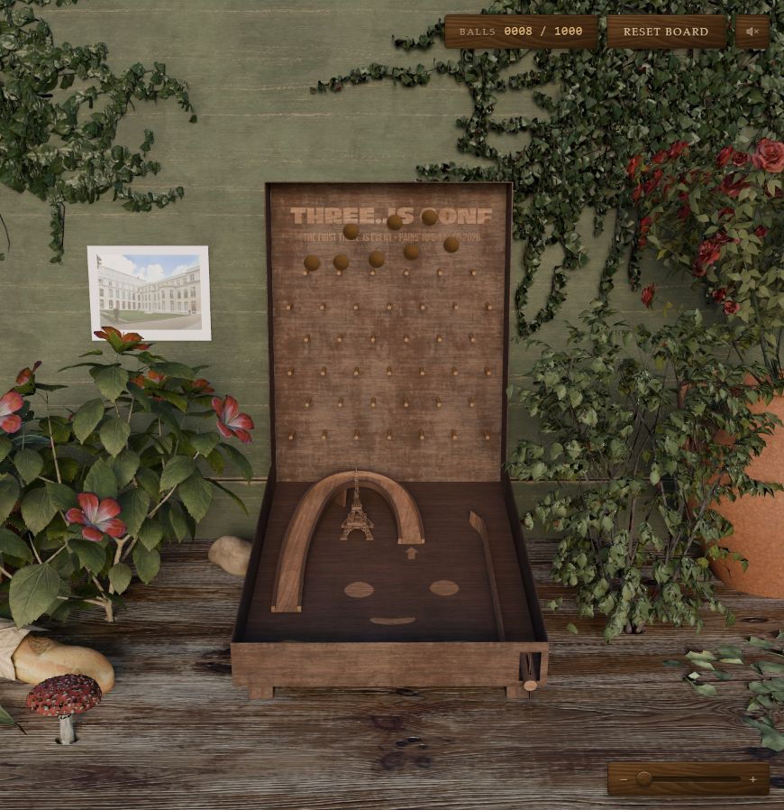

# 013 · Plinkopinball

Plinkopinball 是一个弹珠下落的 3D 游戏：点击投球，看小球穿过钉阵落到弹珠台，再用挡板和蓄力装置继续击球。

## 项目资料

| 项目 | 内容 |
| :--- | :--- |
| 原始仓库 | [andrewwoan/codrops-demo-for-threejs-conference](https://github.com/andrewwoan/codrops-demo-for-threejs-conference) |
| 作者文章 | [Blender to Three.js and Back: 10 Tips for a Better Workflow](https://tympanus.net/codrops/2026/08/24/blender-to-three-js-and-back-10-tips-for-a-better-workflow/) |
| 研究版本 | `64a896ef3ff6b1dac9d6f5d63601f0bc1f43e354`，提交时间 2026-08-25 UTC |
| 上游许可证 | 本次文件树检查未发现仓库级 LICENSE；README 对第三方资产分别署名，不能据此认定整体许可 |
| 技术栈 | Three.js / WebGPURenderer / TSL、Rapier 2D、GSAP、Howler、Vite；Blender 资源制作 |
| 研究状态 | 中文研究与线上展示完成；作者原站基础交互已验证；教学实验通过逻辑测试，未做新页面浏览器交互回归 |
| 收录日期 | 2026-09-10 |
| 最近更新 | 2026-09-10 |
| 本项目在线展示 | [原版体验与中文原理实验](https://yydshly.github.io/0910_codex_project/013-plinkopinball/) · [八种游戏方向试玩](https://yydshly.github.io/0910_codex_project/013-plinkopinball/games.html) |
| 作者原版演示 | [打开作者原站](https://codrops-demo-for-threejs-conference-ten.vercel.app/) |

## 研究摘要

它交付的是一个可在浏览器中运行的具体游戏演示。我们主要学习它如何把三维画面、弹珠运动、输入和音效组织起来，再探索新的玩法。

- **核心能力：** 精细三维场景、投球与碰撞、左右挡板、蓄力机构、拱形轨道、多球管理和动态声音反馈。
- **值得借鉴：** 静态烘焙与动态材质分工；二维物理映射回三维；从模型截面提取碰撞边界；实例化绘制；资源变化自动刷新。
- **适用场景：** 活动主题页、创意作品集、浏览器小游戏、Three.js 教学与物理科普。
- **限制与取舍：** 演示级玩法，没有完整计分、关卡和账号体系；1,000 球为代码容量而非性能保证；复杂自由三维运动需要改造物理架构。

## 展示内容

- **原版 3D 体验：** 页面内嵌作者在线作品，提供独立窗口与中文操作说明。原站由作者维护，加载与可用性依赖原站。
- **原理实验：** 本研究原创的二维教学模拟，可投球、批量投球、操作挡板、调整重力与弹性、查看碰撞边界、暂停和重置。上限 80 球；不复用上游物理代码，不代表原库效果或基准性能。
- **技术拆解：** 点选模型烘焙、碰撞提取、运动求解和画面反馈，查看原理、适用条件及固定版本源码。
- **研究阅读：** 完整中文理解、来源与许可、可下载研究笔记。
- **八种玩法原型：** 物理解谜、弹珠迷宫、打砖块、轨道建造、连锁机关、颜色分类、节奏击球、弹珠竞速。第二版新增三档难度、收集目标、道具、限时机关、长按节奏、三圈竞速和本机成绩；提供自动演示和亲自试玩，均为本研究独立制作，详见 [玩法与验证](notes/03-game-directions.md)。

## 代表性图片

图 1：作者原版游戏的实际运行画面，2026-09-10 以静音模式进入并投下 8 球后截取。来源：[Andrew Woan 的在线演示](https://codrops-demo-for-threejs-conference-ten.vercel.app/)。截图对应当日原站，不保证与固定研究提交完全相同；图源与使用范围见 [图片说明](assets/README.md)。

## 文档与运行

- [完整中文理解](notes/01-understanding.md)
- [八种扩展玩法及验证](notes/03-game-directions.md)
- [技术流程图](assets/capability-overview.svg)
- [来源、许可与验证](notes/02-sources-and-verification.md)
- [Web 展示运行说明](web/README.md)

本项目网页为零第三方依赖的静态展示；原版通过外部 iframe 呈现，不复制完整上游仓库、模型或音频。研究文档中明确区分源码证据、实际测试与扩展建议。

[返回项目索引](../../README.md#项目索引)
